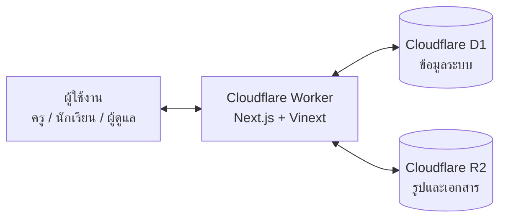
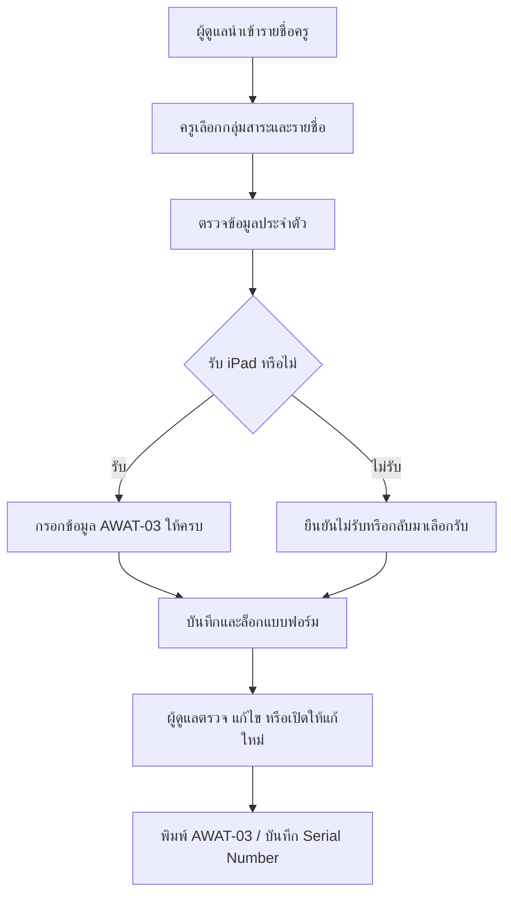
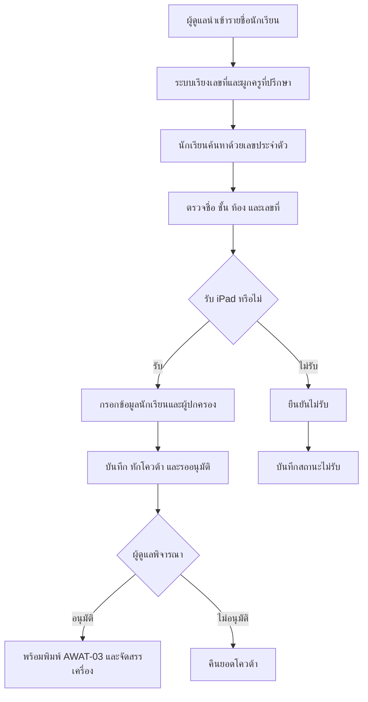
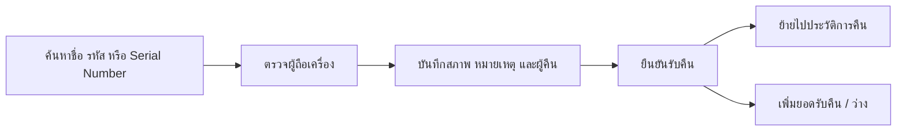

# 📘 คู่มือการใช้งานและติดตั้งระบบลงทะเบียนรับ iPad ยืมเรียน

เอกสารฉบับนี้จัดทำขึ้นเพื่อใช้เป็นแนวทางประกอบการอบรม การดำเนินงาน การติดตั้ง และการอ้างอิงระบบลงทะเบียนรับ iPad ยืมเรียนของโรงเรียนจอมทอง โดยเรียบเรียงตามลำดับการใช้งานจริง ตั้งแต่การเตรียมข้อมูล การเปิดลงทะเบียน การตรวจอนุมัติ การพิมพ์ AWAT-03 การจัดสรรและคืนเครื่อง ไปจนถึงการดูแลระบบบน Cloudflare

คู่มือนี้รวมทั้งส่วนของครู นักเรียน ผู้ดูแลระบบ ผู้ติดตั้ง และผู้รับผิดชอบด้านข้อมูลไว้ในไฟล์เดียว เพื่อให้สามารถนำไปใช้อบรม ติดตั้งระบบใหม่ หรือส่งต่องานได้โดยไม่ต้องอ้างอิงเอกสารหลายฉบับ

## 🌐 1. ภาพรวมของระบบ

ระบบลงทะเบียนรับ iPad ยืมเรียนเป็นเว็บแอปพลิเคชันสำหรับบริหารการรับอุปกรณ์ตามโครงการ Anywhere Anytime โดยเชื่อมงานของครู นักเรียน ผู้ดูแล และงานพัสดุไว้ในระบบเดียว ความสามารถหลักประกอบด้วย

- หน้าแรกสำหรับเลือกลงทะเบียนเป็นครู/บุคลากรหรือนักเรียน
- ครูค้นหารายชื่อจากกลุ่มสาระและยืนยันข้อมูลของตนเอง
- นักเรียนค้นหาด้วยเลขประจำตัวนักเรียน
- บันทึกความประสงค์รับหรือไม่รับ iPad
- ตรวจสอบโดเมนอีเมลโรงเรียน `@chomthong.ac.th` และ NDLP `@ndlp.go.th`
- ตรวจเลขประจำตัวประชาชน รูปแบบเบอร์โทร และข้อมูลที่จำเป็นตาม AWAT-03
- แยกช่วงเวลาเปิด–ปิดลงทะเบียนครู นักเรียน ม.ต้น และนักเรียน ม.ปลาย
- นับโควต้าครูและนักเรียน พร้อมสงวนโควต้า ม.ปลายตามรายชื่อ
- ผู้ดูแลอนุมัติหรือไม่อนุมัติการลงทะเบียนของนักเรียน
- พิมพ์ AWAT-03 รายบุคคลหรือเป็นชุด
- จัดการ Serial Number และบันทึกการคืน iPad ของทั้งครูและนักเรียน
- เก็บประวัติการคืนย้อนหลัง
- นำเข้า/ส่งออกรายชื่อและผลการลงทะเบียนด้วย CSV/XLSX
- กำหนดครูที่ปรึกษา 1–2 คนต่อห้อง และให้ครูหนึ่งคนดูแลได้หลายห้อง
- อัปโหลดประชาสัมพันธ์หลายไฟล์ต่อหัวข้อ แสดงภาพบนหน้าเว็บ และจัดลำดับด้วยการลาก
- เปลี่ยนโลโก้ ข้อความหน้าแรก ข้อมูลโครงการ ผู้อนุมัติ และค่าระบบจากหน้าแอดมิน
- จัดการผู้ดูแลระบบและตรวจ Audit Log
- Responsive สำหรับคอมพิวเตอร์ แท็บเล็ต และโทรศัพท์

## 🎯 2. เป้าหมายของระบบ

ระบบนี้ถูกออกแบบมาเพื่อแก้ปัญหา 6 เรื่องหลัก

1. ลดการใช้กระดาษและการกรอกข้อมูลเดิมซ้ำหลายครั้ง
2. ให้ครูและนักเรียนตรวจสอบข้อมูลของตนเองก่อนบันทึก
3. ให้ผู้ดูแลเห็นยอดลงทะเบียน โควต้า และผลอนุมัติแบบทันที
4. เชื่อมข้อมูลลงทะเบียนกับ AWAT-03, Serial Number และประวัติคืนเครื่อง
5. ลดความผิดพลาดจากโดเมนอีเมล เลขประจำตัวประชาชน เบอร์โทร และข้อมูลที่ไม่ครบ
6. รองรับการติดตั้งซ้ำในโรงเรียนอื่นโดยแยกค่าระบบ ข้อมูล และ Secret ออกจากโค้ด

## 👥 3. บทบาทผู้ใช้งาน

ระบบรองรับผู้ใช้งาน 4 กลุ่มหลัก

### 👩‍🏫 3.1 ครูและบุคลากร

- ค้นหารายชื่อจากกลุ่มสาระ
- ตรวจและเติมข้อมูลส่วนตัวที่ยังขาด
- เลือกรับหรือไม่รับ iPad
- บันทึกข้อมูลเพื่อจัดทำ AWAT-03
- กลับมาแก้ไขได้เมื่อผู้ดูแลเปิดแบบฟอร์มใหม่

### 🧑‍🎓 3.2 นักเรียน

- ยืนยันตัวตนด้วยเลขประจำตัวนักเรียน
- ตรวจชื่อ ชั้น ห้อง เลขที่ และครูที่ปรึกษา
- กรอกข้อมูลนักเรียนและผู้ปกครองตาม AWAT-03
- เลือกรับหรือไม่รับ iPad
- ส่งข้อมูลเพื่อรอผู้ดูแลอนุมัติ

### 🛡️ 3.3 ผู้ดูแลระบบ `admin`

- ดูแดชบอร์ดและรายการลงทะเบียน
- จัดการรายชื่อครู นักเรียน กลุ่มสาระ และครูที่ปรึกษา
- ตรวจ แก้ไข อนุมัติ เปิดให้ลงทะเบียนใหม่ และพิมพ์ AWAT-03
- จัดการประชาสัมพันธ์ การคืนเครื่อง การตั้งค่า และ Audit Log

### 👑 3.4 ผู้ดูแลระบบสูงสุด `superadmin`

มีสิทธิ์ทั้งหมดของ `admin` และสามารถเพิ่ม ปิดใช้งาน รีเซ็ตรหัสผ่าน หรือลบบัญชีผู้ดูแลระบบได้ ระบบไม่อนุญาตให้ลบ `superadmin` คนสุดท้าย

## 🗺️ 4. หน้าใช้งานหลักของระบบ

### 🌍 4.1 หน้าสาธารณะ

| หน้า | URL | ใช้ทำอะไร |
| --- | --- | --- |
| หน้าแรก | `/` | เลือกประเภทผู้ลงทะเบียนและดูภาพรวมโครงการ |
| ลงทะเบียนครู | `/teacher` | เลือกกลุ่มสาระ ค้นหารายชื่อ และลงทะเบียน |
| ลงทะเบียนนักเรียน | `/student` | ค้นหาด้วยเลขประจำตัวนักเรียนและลงทะเบียน |
| ประชาสัมพันธ์ | `/project` | ดูภาพ ข่าว เอกสาร และรายละเอียดโครงการ |
| เข้าสู่ระบบผู้ดูแล | `/admin/login` | ล็อกอินเข้าส่วนจัดการ; หากไม่เคลื่อนไหว 30 นาที ระบบออกจากระบบอัตโนมัติ |

### 🛠️ 4.2 หน้าภายในส่วนผู้ดูแล

| เมนู | URL | งานหลัก |
| --- | --- | --- |
| แดชบอร์ด | `/admin` | ดูภาพรวมครู/นักเรียนและสถานะโควต้า |
| ลงทะเบียนครู | `/admin/results` | ค้นหา ดูรายละเอียด แก้ไข เปิดให้แก้ใหม่ และพิมพ์ |
| ลงทะเบียนนักเรียน | `/admin/student-results` | กรองตามชั้น/ห้อง ตรวจข้อมูล อนุมัติ และพิมพ์ |
| จัดการครู | `/admin/teachers` | เพิ่ม แก้ไข ลบ และนำเข้ารายชื่อครู |
| จัดการนักเรียน | `/admin/students` | เพิ่ม แก้ไข ลบ และนำเข้ารายชื่อนักเรียน |
| กลุ่มสาระ | `/admin/learning-areas` | จัดการกลุ่มสาระการเรียนรู้ |
| ครูที่ปรึกษา | `/admin/advisors` | ผูกครูกับชั้นและห้อง |
| ประชาสัมพันธ์ | `/admin/documents` | เพิ่ม แก้ไข ลบ จัดลำดับรูปและเอกสาร |
| คืน iPad | `/admin/returns` | รับคืนเครื่องและดูประวัติย้อนหลัง |
| ตั้งค่า | `/admin/settings` | ตั้งค่าหน้าเว็บ โควต้า ช่วงเวลา โลโก้ และผู้อนุมัติ |
| Audit Log | `/admin/audit` | ตรวจประวัติการทำรายการ ครั้งละไม่เกิน 50 รายการ |
| จัดการผู้ดูแลระบบ | `/admin/admins` | เพิ่ม แก้ไข หรือลบผู้ดูแล (เฉพาะ superadmin) |

ผู้ดูแลทั่วไปใช้เมนูงานประจำ ส่วน `superadmin` จัดการบัญชีผู้ดูแลและงานที่มีความเสี่ยงสูงได้ ห้ามลบ superadmin คนสุดท้ายออกจากระบบ

## 🧱 5. เทคโนโลยีและสถาปัตยกรรม

### 🏗️ 5.1 โครงสร้างระดับสูง



### 🔩 5.2 ส่วนประกอบหลัก

- Next.js App Router, React และ TypeScript
- Vinext/Vite สำหรับสร้าง Cloudflare Worker
- Tailwind CSS
- Cloudflare D1 สำหรับข้อมูลเชิงโครงสร้าง
- Cloudflare R2 สำหรับโลโก้ รูปภาพ และเอกสารประชาสัมพันธ์
- Drizzle ORM และ D1 migrations
- Zod สำหรับตรวจข้อมูล
- Web Crypto API: AES-GCM, HMAC/SHA-256 และ PBKDF2
- Font Awesome และ Noto Sans Thai

Bindings ที่ Worker ต้องมี:

| Binding/Secret | ชนิด | หน้าที่ |
| --- | --- | --- |
| `DB` | D1 | ฐานข้อมูลหลัก |
| `FILES` | R2 | ไฟล์ประชาสัมพันธ์และโลโก้ |
| `ASSETS` | Worker Assets | ไฟล์หน้าเว็บที่ build แล้ว |
| `SESSION_SECRET` | Secret | ลงนาม token และข้อมูล session |
| `PII_ENCRYPTION_KEY` | Secret | เข้ารหัสข้อมูลส่วนบุคคล |
| `ADMIN_INITIAL_USERNAME` | Secret | ชื่อผู้ดูแลเริ่มต้นสำหรับ bootstrap |
| `ADMIN_INITIAL_PASSWORD` | Secret | รหัสผ่านผู้ดูแลเริ่มต้นสำหรับ bootstrap |

ตารางสำคัญใน D1 ได้แก่ `teachers`, `students`, `survey_responses`, `student_survey_responses`, `device_assignments`, `student_device_assignments`, `class_advisors`, `device_return_history`, `project_documents`, `system_settings`, `admin_users`, `admin_sessions` และ `audit_logs`

### 🗄️ 5.3 ตารางข้อมูลสำคัญ

| ตาราง | หน้าที่ |
| --- | --- |
| `teachers` | รายชื่อและข้อมูลพื้นฐานครู/บุคลากร |
| `students` | รายชื่อนักเรียน ชั้น ห้อง และเลขที่ |
| `survey_responses` | การลงทะเบียนของครูและข้อมูล AWAT-03 |
| `student_survey_responses` | การลงทะเบียนและผลอนุมัติของนักเรียน |
| `device_assignments` | Serial Number ที่จัดสรรให้ครู |
| `student_device_assignments` | Serial Number ที่จัดสรรให้นักเรียน |
| `class_advisors` | ความสัมพันธ์ครูที่ปรึกษากับชั้น/ห้อง |
| `device_return_history` | ประวัติรับคืนและสภาพเครื่อง |
| `project_documents` | Metadata ประชาสัมพันธ์; ไฟล์จริงอยู่ R2 |
| `system_settings` | ข้อมูลโรงเรียน Hero โควต้า และช่วงเวลาเปิดลงทะเบียน |
| `admin_users` / `admin_sessions` | บัญชีและ session ผู้ดูแล |
| `audit_logs` | ประวัติการดำเนินงานสำคัญ |

> การเปิดเว็บไม่ได้สร้าง schema ให้อัตโนมัติ ต้องรัน migrations และ seed ตามคู่มือนี้ก่อนเสมอ วิธีนี้ป้องกันหลาย Worker cold start เขียน schema พร้อมกันในช่วงที่มีผู้ใช้จำนวนมาก

## 🧰 6. สิ่งที่ต้องเตรียมก่อนติดตั้ง

### 🖥️ 6.1 บัญชีและเครื่องมือ

- บัญชี Cloudflare ที่เปิด Workers, D1 และ R2 ได้
- Node.js `22.13.0` ขึ้นไป
- npm และ Git
- OpenSSL สำหรับสร้าง secret
- Chrome หรือ Edge สำหรับตรวจหน้าพิมพ์ AWAT-03

ตรวจเวอร์ชัน:

```bash
node --version
npm --version
```

### 🏫 6.2 ข้อมูลของสถานศึกษา

เตรียมข้อมูลต่อไปนี้ไว้ก่อนเริ่มตั้งค่าระบบ:

- ชื่อระบบ ชื่อโครงการ และข้อความ Hero
- ชื่อสถานศึกษา ตำบล อำเภอ จังหวัด และหน่วยงานต้นสังกัด
- โลโก้โรงเรียนชนิด JPG, PNG หรือ WebP ขนาดไม่เกิน 5 MB
- ยี่ห้อและรุ่นอุปกรณ์
- จำนวนเครื่องสำหรับครู/บุคลากรและนักเรียน
- ชื่อผู้ลงนามอนุมัติของครูและของนักเรียน ซึ่งตั้งแยกกันได้
- วัน–เวลาเปิดและปิดลงทะเบียนครู นักเรียน ม.ต้น และนักเรียน ม.ปลาย
- รายชื่อกลุ่มสาระ ครู นักเรียน และครูที่ปรึกษา
- รูปภาพหรือ PDF สำหรับประชาสัมพันธ์

### 🔑 6.3 Secret ที่ต้องเก็บอย่างปลอดภัย

สร้างค่าแบบสุ่มสองค่า:

```bash
openssl rand -base64 32
openssl rand -base64 32
```

- ค่าที่หนึ่งใช้เป็น `SESSION_SECRET`
- ค่าที่สองใช้เป็น `PII_ENCRYPTION_KEY`

`PII_ENCRYPTION_KEY` ต้องเก็บสำรองใน password manager หรือที่เก็บ secret ขององค์กร หากสูญหายหรือเปลี่ยนค่าโดยไม่ได้ย้ายข้อมูล ข้อมูลส่วนบุคคลเดิมจะถอดรหัสไม่ได้

อย่าใส่ secret หรือรหัสผ่านจริงใน Git, README, ไฟล์ที่ถูก commit, รูปหน้าจอ หรือห้องสนทนาสาธารณะ

## 👩‍🏫 7. การเตรียมไฟล์รายชื่อครู

ระบบรับไฟล์ CSV และ XLSX แนะนำให้ดาวน์โหลด Template จากหน้า **จัดการครู → นำเข้ารายชื่อ** แล้วกรอกในไฟล์นั้น

| คอลัมน์ | จำเป็น | ตัวอย่าง/เงื่อนไข |
| --- | --- | --- |
| `prefix` / คำนำหน้า | ใช่ | นาย, นาง, นางสาว |
| `first_name` / ชื่อ | ใช่ | ไม่ใส่คำนำหน้าซ้ำในช่องชื่อ |
| `last_name` / นามสกุล | ใช่ | นามสกุลอย่างเดียว |
| `learning_area` / กลุ่มสาระ | ใช่ | ต้องตรงกับกลุ่มสาระ หรือยืนยันสร้างกลุ่มใหม่ตอนนำเข้า |
| `position` / ตำแหน่ง | ไม่บังคับ | ผู้บริหาร, ครู, ครูอัตราจ้าง |
| `academic_rank` / วิทยฐานะ | ไม่บังคับ | ไม่มีวิทยฐานะ, ชำนาญการ, ชำนาญการพิเศษ, เชี่ยวชาญ, เชี่ยวชาญพิเศษ |
| `email` / อีเมลโรงเรียน | ไม่บังคับตอนนำเข้า | ถ้ามีต้องลงท้าย `@chomthong.ac.th` |
| `ndlp_email` / อีเมล NDLP | ไม่บังคับตอนนำเข้า | ถ้ามีต้องลงท้าย `@ndlp.go.th` |
| `phone` / เบอร์โทรศัพท์ | ไม่บังคับตอนนำเข้า | รูปแบบเบอร์โทรไทย |

ไม่ต้องใส่รหัสบุคลากร ระบบสร้างรหัส `CT-...` ให้อัตโนมัติ ข้อมูลที่เว้นว่างจะถูกบังคับให้ครูกรอกให้ครบเมื่อลงทะเบียนรับ iPad

ก่อนนำเข้าให้ตรวจ:

1. ไม่มีแถวหัวตารางซ้ำหรือแถวว่างคั่นกลาง
2. ชื่อและนามสกุลไม่รวมอยู่ช่องเดียวกัน
3. คำนำหน้าไม่ซ้ำในช่องชื่อ
4. กลุ่มสาระสะกดเหมือนกันทั้งไฟล์
5. ไม่มีช่องว่างท้ายอีเมล
6. บันทึก CSV เป็น UTF-8 เพื่อไม่ให้ภาษาไทยเสีย

ระบบจับรายการเดิมจากคำนำหน้า ชื่อ นามสกุล และกลุ่มสาระ แล้วอัปเดตแทนการสร้างซ้ำ รองรับครั้งละไม่เกิน 3,000 แถว

## 🧑‍🎓 8. การเตรียมไฟล์รายชื่อนักเรียน

ระบบรับ CSV และ XLSX แนะนำให้ใช้ Template จากหน้า **จัดการนักเรียน → นำเข้ารายชื่อ**

| คอลัมน์ | จำเป็น | ตัวอย่าง/เงื่อนไข |
| --- | --- | --- |
| `studentCode` / รหัสนักเรียน | ใช่ | รหัสไม่ซ้ำ เช่น `23964` |
| `prefix` / คำนำหน้า | ใช่ | เด็กชาย, เด็กหญิง, นาย, นางสาว |
| `firstName` / ชื่อ | ใช่ | ไม่ใส่คำนำหน้าซ้ำ |
| `lastName` / นามสกุล | ใช่ | นามสกุลอย่างเดียว |
| `gradeLevel` / ระดับชั้น | ใช่ | มัธยมศึกษาปีที่ 1–6 หรือ M1–M6 |
| `room` / ห้อง | ใช่ | 1–13 |
| `birthDate` / วันเกิด | ไม่บังคับ | `YYYY-MM-DD` หรือ `DD/MM/YYYY`; ปี พ.ศ. แปลงให้อัตโนมัติ |
| `phone` / เบอร์โทรศัพท์ | ไม่บังคับ | เบอร์นักเรียน |
| `email` / อีเมลโรงเรียน | ไม่บังคับ | ถ้ามีต้องลงท้าย `@chomthong.ac.th` |
| `ndlpEmail` / อีเมล NDLP | ไม่บังคับ | ถ้ามีต้องลงท้าย `@ndlp.go.th` |

ระบบรองรับชื่อหัวคอลัมน์ภาษาไทย เช่น `เลขประจำตัวนักเรียน`, `ระดับชั้น`, `ห้อง`, `วันเกิด`, `เบอร์โทรศัพท์`, `อีเมลโรงเรียน` และ `อีเมล NDLP`

หลังนำเข้าระบบจะ:

1. อัปเดตรายการเดิมที่มีรหัสนักเรียนตรงกัน
2. เพิ่มรายการที่ยังไม่มี
3. เรียงเลขที่ใหม่แยกตามห้อง
4. เรียงนักเรียนชายก่อน แล้วเรียงตามเลขประจำตัวนักเรียน
5. เชื่อมครูที่ปรึกษาตามชั้น/ห้องโดยอัตโนมัติ

รองรับครั้งละไม่เกิน 3,000 แถว หากมีมากกว่านี้ให้แบ่งเป็นหลายไฟล์

## 💻 9. ติดตั้งและใช้งานในเครื่อง

### 📦 9.1 ติดตั้ง dependencies

```bash
npm install
```

### 🔑 9.2 สร้างไฟล์ตัวแปรลับ

```bash
cp .dev.vars.example .dev.vars
```

แก้ `.dev.vars`:

```dotenv
SESSION_SECRET=ค่าที่สุ่มสำหรับ-session
PII_ENCRYPTION_KEY=ค่าที่สุ่มสำหรับเข้ารหัสข้อมูล
ADMIN_INITIAL_USERNAME=ชื่อผู้ดูแลเริ่มต้น
ADMIN_INITIAL_PASSWORD=รหัสผ่านที่คาดเดายาก
ADMIN_INITIAL_DISPLAY_NAME=ผู้ดูแลระบบ
```

ไฟล์ `.dev.vars` ถูก ignore ไว้แล้ว ห้ามนำออกจาก `.gitignore`

### 🗄️ 9.3 สร้างฐานข้อมูล local

```bash
npm run db:migrate:local
npm run db:seed:local
```

คำสั่ง seed ใช้ `INSERT OR IGNORE` จึงรันซ้ำได้ แต่ไม่ควรแก้ migration ที่เคยใช้ใน production แล้ว ให้สร้าง migration ใหม่แทน

### ▶️ 9.4 เปิดระบบสำหรับพัฒนา

```bash
npm run dev
```

เปิดหน้าเว็บที่ `http://localhost:3000` และผู้ดูแลที่ `http://localhost:3000/admin/login`

เมื่อฐานข้อมูลยังไม่มีผู้ดูแล ระบบจะสร้าง `superadmin` เมื่อเข้าสู่ระบบสำเร็จครั้งแรกด้วย `ADMIN_INITIAL_USERNAME` และ `ADMIN_INITIAL_PASSWORD`

### 🧪 9.5 ตรวจ build แบบ Worker ในเครื่อง

```bash
npm run build
npm start
```

เปิด URL ที่ Wrangler แสดงใน Terminal โดยปกติคือ `http://localhost:8787`

## ☁️ 10. ติดตั้งขึ้น Cloudflare ด้วยมือ

ส่วนนี้ใช้สำหรับสร้างระบบใหม่ในบัญชี Cloudflare ไม่ใช่การอัปเดตระบบเดิม

### 🔐 10.1 ล็อกอินและตรวจบัญชี

```bash
npx wrangler login
npx wrangler whoami
```

ตรวจอีเมลและ Account ID ให้ถูกบัญชีก่อนสร้างทรัพยากรทุกครั้ง

### 🏷️ 10.2 ตั้งชื่อ Worker

คัดลอกไฟล์ตั้งค่าตัวอย่างก่อน ไฟล์จริงถูก `.gitignore` ไว้เพื่อป้องกัน resource identifier ของระบบจริงขึ้น Git:

```bash
cp wrangler.example.jsonc wrangler.jsonc
```

ค่าเริ่มต้นในไฟล์ตัวอย่างคือ `"name": "ipad"` หากติดตั้งให้โรงเรียนอื่น ให้ตั้งชื่อ Worker, D1 และ R2 ที่ไม่ซ้ำกับของเดิม เช่น `ipad-schoolname`

### 🗄️ 10.3 สร้าง D1

```bash
npx wrangler d1 create ipad
```

คัดลอก `database_id` ที่ Cloudflare ตอบกลับไปใส่ใน `wrangler.jsonc`:

```jsonc
"d1_databases": [
  {
    "binding": "DB",
    "database_name": "ipad",
    "database_id": "ใส่-D1-database-id-ที่ได้",
    "migrations_dir": "migrations"
  }
]
```

### 🗂️ 10.4 สร้าง R2 bucket

```bash
npx wrangler r2 bucket create teacher-ipad-documents
```

ชื่อใน `wrangler.jsonc` ต้องตรงกัน:

```jsonc
"r2_buckets": [
  {
    "binding": "FILES",
    "bucket_name": "teacher-ipad-documents"
  }
]
```

R2 ต้องเปิดใช้งานในบัญชี Cloudflare ก่อนสร้าง bucket

### 🔑 10.5 ตั้ง Worker Secrets

```bash
npx wrangler secret put SESSION_SECRET
npx wrangler secret put PII_ENCRYPTION_KEY
npx wrangler secret put ADMIN_INITIAL_USERNAME
npx wrangler secret put ADMIN_INITIAL_PASSWORD
```

แต่ละคำสั่งจะให้วางค่าผ่าน prompt จึงไม่ทิ้ง secret ไว้ใน shell history

### 🧱 10.6 สร้าง schema และข้อมูลตั้งต้นบน D1

```bash
npm run db:migrate:remote
npm run db:seed:remote
npx wrangler d1 migrations list ipad --remote
```

### 🚀 10.7 ตรวจระบบและ Deploy

```bash
npm run lint
npm run test
npm run deploy
```

`npm run test` จะ build ระบบก่อนจึงใช้เวลามากกว่า lint ค่าเริ่มต้นของ repository นี้เผยแพร่ Worker ชื่อ `ipad`

### 👑 10.8 สร้างผู้ดูแลคนแรก

1. เปิด `/admin/login`
2. เข้าด้วย initial username/password ที่ตั้งเป็น Secret
3. ระบบจะสร้างบัญชี `superadmin` เฉพาะเมื่อยังไม่มีผู้ดูแล
4. ไปที่ **จัดการผู้ดูแลระบบ** แล้วสร้างบัญชีใช้งานจริง
5. ทดลองออกจากระบบและล็อกอินด้วยบัญชีใหม่
6. เมื่อตรวจแล้วจึงลบ bootstrap secrets:

```bash
npx wrangler secret delete ADMIN_INITIAL_USERNAME
npx wrangler secret delete ADMIN_INITIAL_PASSWORD
```

อย่าลบ `SESSION_SECRET` หรือ `PII_ENCRYPTION_KEY`

### 🌐 10.9 ผูก Custom Domain (ถ้าต้องการ)

Domain ต้องอยู่ใน Cloudflare account/zone ที่ควบคุมได้ เพิ่มใน `wrangler.jsonc`:

```jsonc
"routes": [
  {
    "pattern": "ipad.example.ac.th",
    "custom_domain": true
  }
]
```

แล้วรัน `npm run deploy` อีกครั้ง

### ✅ 10.10 ตรวจหลัง Deploy

- หน้าแรก โลโก้ เมนู และ Hero แสดงครบทั้งคอมและมือถือ
- `/project` เปิดรูปและ PDF ได้
- ลงทะเบียนครูและนักเรียนทดสอบอย่างละหนึ่งรายการ
- อีเมลผิดโดเมนถูกปฏิเสธ
- ผู้ดูแลเห็นข้อมูลและอนุมัตินักเรียนได้
- Print AWAT-03 แสดงภาษาไทยและข้อมูลถูกต้อง
- ลบ/เปลี่ยนไฟล์ประชาสัมพันธ์แล้วไฟล์เก่าไม่ปรากฏ
- เปิด Audit Log แล้วพบรายการที่เพิ่งทดสอบ

## 🔄 11. อัปเดตระบบเดิม

ก่อนอัปเดต production ให้สำรองฐานข้อมูลเสมอ

```bash
npx wrangler whoami
npx wrangler d1 export ipad --remote --output backup-ipad-YYYY-MM-DD.sql
npm install
npm run lint
npm run test
npm run db:migrate:remote
npm run deploy
```

หลักปฏิบัติ:

1. ตรวจว่า `wrangler whoami` เป็นบัญชีที่ถูกต้อง
2. ห้ามรัน seed เพื่อแก้ข้อมูลจริงทั่วไป Seed ใช้เฉพาะข้อมูลตั้งต้น
3. ห้ามลบหรือแก้ migration ที่เคยใช้แล้ว
4. หาก migration ล้มเหลว อย่า Deploy โค้ดที่ต้องใช้ schema ใหม่นั้น
5. หลัง Deploy ให้ทดสอบเส้นทางหลักและตรวจ Worker Logs

## 🔄 12. กระบวนการทำงานของระบบ

ส่วนนี้อธิบายลำดับงานตั้งแต่เตรียมรายชื่อจนถึงคืนเครื่อง เพื่อให้ผู้รับผิดชอบแต่ละฝ่ายเข้าใจว่างานของตนเชื่อมกับส่วนใด

### 👩‍🏫 12.1 กระบวนการลงทะเบียนของครูและบุคลากร



หลักการสำคัญ:

- ครูต้องมีรายชื่อในระบบก่อนจึงลงทะเบียนได้
- ข้อมูลที่ไม่ได้ใส่มาตอนนำเข้าจะถูกบังคับให้กรอกเมื่อเลือกรับ
- เมื่อบันทึกสำเร็จ แบบฟอร์มถูกล็อกและนับโควต้าทันที
- การเปิดให้แก้ใหม่ต้องดำเนินการโดยผู้ดูแลและถูกบันทึกใน Audit Log

### 🧑‍🎓 12.2 กระบวนการลงทะเบียนและอนุมัตินักเรียน



หลักการสำคัญ:

- ใช้เลขประจำตัวนักเรียนยืนยันเบื้องต้น ไม่แสดงรายชื่อทั้งหมดต่อสาธารณะ
- ระบบผูกครูที่ปรึกษาจากชั้นและห้องโดยอัตโนมัติ
- การลงทะเบียนรับหักโควต้าทันที ส่วนการไม่อนุมัติคืนยอดให้โดยอัตโนมัติ
- โควต้า ม.ปลายสงวนตามรายชื่อที่เปิดใช้งาน และแยกจากยอดที่ ม.ต้น ใช้ได้

### 📄 12.3 กระบวนการ AWAT-03 และการจัดสรรเครื่อง

1. ผู้ดูแลเปิดรายละเอียดผู้ลงทะเบียน
2. ตรวจข้อมูลส่วนบุคคล ที่อยู่ อีเมล เบอร์โทร ผู้ปกครอง และผู้อนุมัติ
3. ถ้าข้อมูลผิด ให้แก้จากหน้าแอดมินหรือเปิดให้เจ้าของข้อมูลแก้ใหม่
4. กด **พิมพ์ AWAT-03** แบบรายบุคคล หรือใช้ **Batch Print** ตามตัวกรอง
5. เมื่อตรวจเครื่องจริงแล้วจึงบันทึก Serial Number ให้ตรงกับผู้รับ
6. การบันทึก Serial Number ไม่ใช่จุดหักโควต้า เพราะระบบหักตั้งแต่ลงทะเบียนรับแล้ว

### 🔁 12.4 กระบวนการคืน iPad



ประวัติการคืนไม่ควรถูกลบเพื่อแก้ยอด หากบันทึกผิดให้ตรวจ Audit Log และแก้ตามกระบวนการของผู้ดูแลระบบ

### 📣 12.5 กระบวนการประชาสัมพันธ์

1. สร้างหัวข้อและคำอธิบาย
2. เลือกรูปหลายรูปหรือ PDF
3. ตรวจภาพตัวอย่างและลากเรียงลำดับ
4. เปิดสถานะ **เผยแพร่บนหน้าเว็บ**
5. บันทึก แล้วตรวจหน้า `/project`
6. เมื่อแก้ไข ระบบแสดงไฟล์เดิมเพื่อให้เพิ่ม ลบ เปลี่ยน หรือจัดลำดับใหม่ได้

## ⚙️ 13. ตั้งค่าระบบครั้งแรก

เข้าสู่ระบบแล้วเปิด **ตั้งค่า** จากนั้นกรอกชื่อระบบ/โครงการ ข้อมูลโรงเรียน ยี่ห้อ/รุ่น โลโก้ ผู้อนุมัติครู ผู้อนุมัตินักเรียน ข้อความ Hero ข้อความประกาศ โควต้า และช่วงเวลาลงทะเบียน

ระบบคำนวณสถานะจากสวิตช์และช่วงเวลา หากไม่ได้กำหนดเวลา ระบบใช้สถานะจากสวิตช์ เมื่อบันทึกสำเร็จฟอร์มจะถูกล็อกเพื่อป้องกันการแก้โดยไม่ตั้งใจ ให้กด **แก้ไขการตั้งค่า** ด้านล่างก่อนจึงแก้และบันทึกใหม่ได้

ลำดับเตรียมระบบที่แนะนำ:

1. ตั้งค่าข้อมูลโรงเรียน โควต้า และผู้อนุมัติ
2. ตรวจหรือเพิ่มกลุ่มสาระ
3. นำเข้ารายชื่อครู
4. นำเข้ารายชื่อนักเรียน
5. กำหนดครูที่ปรึกษา
6. เพิ่มประชาสัมพันธ์
7. ตรวจหน้าเว็บและ AWAT-03
8. กำหนดเวลาเปิดลงทะเบียน

## 👩‍🏫 14. คู่มือสำหรับครูและบุคลากร

### 🔎 14.1 ค้นหาและตรวจสอบรายชื่อ

1. เปิดหน้าแรกแล้วเลือก **ครูและบุคลากร**
2. เลือกกลุ่มสาระ ค้นหา และเลือกรายชื่อของตนเอง
3. ตรวจชื่อ กลุ่มสาระ และข้อมูลที่ระบบแสดง

ถ้าไม่พบชื่อ ห้ามเลือกรายชื่อของบุคคลอื่น ให้ติดต่อผู้ดูแลเพื่อตรวจกลุ่มสาระ สถานะเปิดใช้งาน และการสะกดชื่อ

### 📱 14.2 เลือกความประสงค์และกรอกข้อมูล

1. เลือก **รับ iPad** หรือ **ไม่รับ iPad**
2. ถ้าเลือกรับ ให้กรอกตำแหน่ง วิทยฐานะ อีเมลโรงเรียน อีเมล NDLP เบอร์โทร เลขประจำตัวประชาชน และที่อยู่ที่ยังขาด
3. อ่านเงื่อนไข ตรวจข้อมูลอีกครั้ง แล้วบันทึก
4. รอข้อความยืนยันว่าระบบบันทึกสำเร็จและล็อกแบบฟอร์มแล้ว

### ✏️ 14.3 เมื่อต้องการแก้ข้อมูล

หลังบันทึก ครูไม่สามารถแก้ข้อมูลเองได้ ให้แจ้งผู้ดูแลเลือก **เปิดให้ครูแก้ไข** จากหน้ารายละเอียด จากนั้นกลับเข้าหน้าลงทะเบียน เลือกรายชื่อเดิม แก้ข้อมูล และบันทึกใหม่

ข้อควรทราบ:

- อีเมลโรงเรียนต้องลงท้าย `@chomthong.ac.th`
- อีเมล NDLP ต้องลงท้าย `@ndlp.go.th`; หากลืมให้ติดต่อครูวิทยาหรือครูธนา
- หลังบันทึก แบบฟอร์มจะถูกล็อก ผู้ดูแลสามารถเปิดให้แก้ใหม่ได้
- หากเลือกไม่รับ ระบบแสดงข้อความขอความอนุเคราะห์ให้รับอุปกรณ์ และยังกลับมาเลือกรับได้ก่อนยืนยัน

## 🧑‍🎓 15. คู่มือสำหรับนักเรียน

### 🪪 15.1 ค้นหาและยืนยันข้อมูลนักเรียน

1. เปิดหน้าแรกแล้วเลือก **นักเรียน**
2. กรอกเลขประจำตัวนักเรียนเพื่อค้นหา
3. ตรวจชื่อ ระดับชั้น ห้อง เลขที่ และครูที่ปรึกษา

หากชื่อ ชั้น ห้อง เลขที่ หรือครูที่ปรึกษาไม่ถูกต้อง ให้หยุดและแจ้งครูที่ปรึกษาหรือผู้ดูแลก่อนบันทึก

### 📝 15.2 กรอกข้อมูล AWAT-03

1. เลือก **รับ iPad** หรือ **ไม่รับ iPad**
2. ถ้าเลือกรับ ให้กรอกข้อมูลนักเรียนตาม AWAT-03 ให้ครบ
3. กรอกเลขประจำตัวประชาชน เบอร์โทร อีเมลโรงเรียน และอีเมล NDLP ของนักเรียน
4. กรอกชื่อ–นามสกุลและเบอร์โทรผู้ปกครอง โดยไม่ต้องกรอกเลขประจำตัวประชาชนผู้ปกครอง
5. ตรวจที่อยู่ตามทะเบียนบ้าน โดยเฉพาะตำบล อำเภอ จังหวัด และรหัสไปรษณีย์
6. ยอมรับเงื่อนไข บันทึก และรอผู้ดูแลอนุมัติ

### ✅ 15.3 สถานะหลังบันทึก

- **รออนุมัติ** หมายถึงข้อมูลส่งแล้วและหักโควต้าไว้ แต่ผู้ดูแลยังไม่พิจารณา
- **อนุมัติ** หมายถึงผ่านการตรวจและพร้อมดำเนินการเอกสาร/จัดสรรเครื่อง
- **ไม่อนุมัติ** หมายถึงคำขอไม่ผ่านและระบบคืนยอดโควต้า
- **เปิดให้ลงทะเบียนใหม่** หมายถึงผู้ดูแลปลดล็อกแบบฟอร์มให้นักเรียนกลับมาแก้หรือส่งใหม่ได้

ข้อควรทราบ:

- กรอกคำนำหน้าผู้ปกครองรวมกับชื่อ เช่น `นายสมชาย ใจดี`
- ห้ามใส่คำนำหน้าซ้ำ เช่น `นาย นายสมชาย`
- อีเมลใช้กติกาโดเมนเดียวกับครู
- นักเรียน ม.ปลายที่เลือกไม่รับจะเห็นข้อความขอความอนุเคราะห์ให้รับ iPad เช่นเดียวกับครู
- เมื่อผู้ดูแลเปิดให้ลงทะเบียนใหม่ ระบบจะคืนสถานะแบบฟอร์มให้กรอกอีกครั้ง

## 👑 16. คู่มือสำหรับผู้ดูแลระบบ

### 📊 16.1 แดชบอร์ด

1. สลับแท็บ **ครูและบุคลากร** หรือ **นักเรียน**
2. ตรวจยอดทั้งหมด ลงทะเบียนแล้ว รับ ไม่รับ ยังไม่ลงทะเบียน และจำนวนเครื่องคงเหลือ
3. ตรวจกราฟแยกตามกลุ่มสาระหรือระดับชั้นเพื่อหากลุ่มที่ยังตอบน้อย
4. กดเมนูลงทะเบียนที่เกี่ยวข้องเพื่อดูรายบุคคล

### 👥 16.2 จัดการครูและนักเรียน

1. ใช้ช่องค้นหาและตัวกรองก่อนแก้ข้อมูลจำนวนมาก
2. เพิ่มรายบุคคล หรือกด **นำเข้ารายชื่อ** เพื่ออัปโหลด CSV/XLSX
3. ตรวจ preview, รายการซ้ำ และข้อผิดพลาดทุกแถวก่อนยืนยัน
4. หลังนำเข้าให้ตรวจยอดรวมและสุ่มเปิดรายละเอียดอย่างน้อยหนึ่งรายการต่อชั้น/กลุ่มสาระ
5. นักเรียนเรียงเลขที่อัตโนมัติโดยเพศชายก่อน แล้วเรียงรหัสภายในห้อง
6. ตารางแสดงครั้งละ 50 รายการและใช้ pagination เมื่อมีข้อมูลมากกว่า
7. เปิดรายละเอียดเพื่อดูข้อมูลที่ซ่อนจากตาราง เช่น ครูที่ปรึกษา อีเมล และข้อมูลลงทะเบียน

### ✅ 16.3 ตรวจการลงทะเบียน

**ครูและบุคลากร**

1. กรองกลุ่มสาระและสถานะ
2. กดรายละเอียดเพื่อตรวจข้อมูล อีเมล และที่อยู่
3. แก้ไข เปิดให้ครูแก้ใหม่ บันทึก Serial Number หรือพิมพ์ AWAT-03 ตามงานที่ต้องทำ

**นักเรียน**

1. กรองระดับชั้น ห้อง สถานะการลงทะเบียน และผลอนุมัติ
2. เปิดรายละเอียดเพื่อตรวจข้อมูลนักเรียน ผู้ปกครอง และครูที่ปรึกษา
3. กดอนุมัติเมื่อข้อมูลครบ หรือไม่อนุมัติพร้อมดำเนินการตามระเบียบของโรงเรียน
4. เมื่อไม่อนุมัติ ระบบคืนยอดโควต้าให้อัตโนมัติ

ทั้งสองส่วนดาวน์โหลดสรุป CSV, XLSX และพิมพ์ AWAT-03 รายบุคคลหรือเป็นชุดได้ ไฟล์ส่งออกถือเป็นข้อมูลอ่อนไหวและต้องเก็บในพื้นที่จำกัดสิทธิ์

### 🧑‍🏫 16.4 ครูที่ปรึกษา

1. เลือกระดับชั้นและห้อง
2. พิมพ์ชื่อเพื่อค้นหาครูแบบ instant
3. เลือกครูที่ปรึกษาคนที่ 1 ซึ่งเป็นข้อมูลบังคับ
4. เลือกคนที่ 2 ถ้าห้องนั้นมีครูสองคน
5. กดบันทึกและตรวจรายชื่อในตาราง

หนึ่งห้องมีครูที่ปรึกษา 1–2 คน และครูหนึ่งคนดูแลได้หลายห้อง นักเรียนที่เพิ่มหรือย้ายเข้าจะเชื่อมตามชั้น/ห้องโดยอัตโนมัติ

### 📣 16.5 ประชาสัมพันธ์

1. กดเพิ่มประชาสัมพันธ์ แล้วกรอกชื่อเรื่องและคำอธิบาย
2. เลือก JPG, PNG, WebP, GIF หรือ PDF ได้หลายไฟล์ในหัวข้อเดียว
3. ตรวจ preview และลากเรียงไฟล์ก่อน–หลัง
4. เปิดสวิตช์เผยแพร่แล้วบันทึก
5. ลากจัดลำดับหัวข้อบนหน้าแอดมินเพื่อกำหนดลำดับหน้าเว็บ
6. เมื่อต้องแก้ ให้กดแก้ไข ระบบจะแสดงไฟล์เดิมเพื่อเพิ่ม ลบ เปลี่ยน หรือจัดลำดับใหม่
7. เมื่อลบหรือแทนไฟล์ ระบบลบ object เดิมใน R2 และอัปเดตข้อมูลใน D1

ตัวแอปไม่กำหนดเพดานขนาดไฟล์ประชาสัมพันธ์เอง แต่ยังอยู่ภายใต้ขีดจำกัด request และ storage ของแผน Cloudflare ควรย่อรูปสำหรับเว็บเพื่อลดเวลาโหลดและค่าใช้จ่าย

### 🔁 16.6 คืน iPad

1. เปิดแท็บ **เครื่องที่จัดสรรอยู่**
2. ค้นหาจากชื่อ รหัส หรือ Serial Number ของครูหรือนักเรียน
3. ตรวจผู้ถือเครื่องและ Serial Number ให้ตรงกับเครื่องจริง
4. บันทึกผู้คืน สภาพเครื่อง หมายเหตุ และผู้ดำเนินการ
5. ยืนยันรับคืน ระบบเพิ่มจำนวน **รับคืน/ว่าง** และย้ายรายการไปแท็บ **ประวัติการคืน**

### 🛡️ 16.7 จัดการผู้ดูแลระบบ

เฉพาะ `superadmin` สามารถเพิ่มบัญชี กำหนดชื่อแสดงผล บทบาท สถานะ และรีเซ็ตรหัสผ่านได้ ควรสร้างบัญชีแยกให้ผู้ปฏิบัติงานทุกคน ไม่ควรแชร์บัญชีเดียวกัน เพราะ Audit Log จะระบุตัวผู้ทำรายการไม่ได้

### 📋 16.8 Audit Log

- ตรวจประวัติการดู แก้ไข อนุมัติ ส่งออก ลบ และงานสำคัญอื่น
- แสดงครั้งละไม่เกิน 50 รายการ และกดเปลี่ยนหน้าเองเมื่อมีข้อมูลมากกว่า
- ใช้ตัวกรองเพื่อจำกัดช่วงข้อมูลก่อนตรวจสอบ
- Audit Log ใช้ตรวจย้อนหลัง ไม่ควรแก้หรือลบเพื่อปกปิดการดำเนินงาน

## 📦 17. กติกาโควต้าและสถานะ

### 👩‍🏫 17.1 ครูและบุคลากร

- โควต้าตั้งจากหน้า **ตั้งค่า**
- เมื่อบันทึกรับ iPad และแบบฟอร์มถูกล็อก ระบบนับว่าใช้โควต้าแล้ว
- ไม่ต้องรอ Serial Number จึงจะหักยอด

### 🧑‍🎓 17.2 นักเรียน

- ลงทะเบียนรับ iPad แล้วหักยอดทันที ไม่ต้องรอ Serial Number
- นักเรียนยังมีสถานะรอผู้ดูแลอนุมัติ
- ถ้าผู้ดูแลไม่อนุมัติ ระบบคืนยอดโควต้า
- ม.ปลายถูกสงวนโควต้าตามรายชื่อนักเรียนที่เปิดใช้งานก่อน
- โควต้า ม.ต้นคำนวณจากโควต้านักเรียนรวมลบจำนวนที่สงวนให้ ม.ปลาย
- หน้าลงทะเบียนแสดงจำนวนเครื่องคงเหลือ

ก่อนเปิดจริงควรตรวจจำนวนรายชื่อ ม.ปลายกับจำนวนจัดสรร และทดสอบกรณีลงทะเบียน อนุมัติ ไม่อนุมัติ เปิดให้ลงทะเบียนใหม่ และคืนเครื่องอย่างละหนึ่งรายการ

## 💾 18. สำรองและกู้คืนข้อมูล

### 🗄️ 18.1 สำรอง D1

```bash
npx wrangler d1 export ipad --remote --output backup-ipad-YYYY-MM-DD.sql
```

ตั้งชื่อไฟล์ให้มีวันที่จริงและเก็บนอกเครื่องพัฒนาอย่างน้อยหนึ่งชุด ไฟล์สำรองมีข้อมูลส่วนบุคคล ต้องเข้ารหัสและจำกัดสิทธิ์เข้าถึง

### ♻️ 18.2 กู้คืนไปฐานใหม่

วิธีปลอดภัยคือสร้างฐานใหม่ก่อน แล้ว import ไฟล์สำรอง จากนั้นเปลี่ยน `database_id` และตรวจระบบก่อนสลับใช้งานจริง

```bash
npx wrangler d1 create ipad-restore
npx wrangler d1 execute ipad-restore --remote --file=./backup-ipad-YYYY-MM-DD.sql
```

อย่า import ทับ production โดยไม่มีสำเนาสำรองและแผนย้อนกลับ

### 🗂️ 18.3 สำรอง R2 และ Secret

D1 เก็บ metadata แต่ไฟล์จริงอยู่ R2 การสำรอง D1 อย่างเดียวไม่พอ ควรสำรอง bucket ด้วย Cloudflare Dashboard หรือเครื่องมือ S3-compatible/rclone และเก็บ `PII_ENCRYPTION_KEY` ไว้ในที่ปลอดภัยแยกจาก SQL

## 🔐 19. ความปลอดภัยและข้อมูลส่วนบุคคล

- ข้อมูลส่วนบุคคลสำคัญถูกเข้ารหัส AES-GCM ก่อนเก็บ D1
- รหัสผ่านใช้ PBKDF2 แบบมี salt และรวมการคำนวณ 300,000 รอบสำหรับบัญชีใหม่
- Admin session ฝั่งเซิร์ฟเวอร์หมดอายุเมื่อไม่มีการเคลื่อนไหวเกิน 30 นาที และหน้าเว็บจะพากลับไปหน้าเข้าสู่ระบบอัตโนมัติ
- Cookie เป็น HttpOnly, SameSite=Lax และ Secure เมื่อใช้ HTTPS
- Write API ตรวจ origin, validation และ rate limit
- Public API ไม่ส่งเลขประชาชน ที่อยู่ hash รหัสผ่าน หรือข้อมูลผู้ดูแล
- การดู แก้ไข อนุมัติ ส่งออก และลบข้อมูลสำคัญถูกบันทึก Audit Log
- Full export และไฟล์สำรองถือเป็นข้อมูลอ่อนไหว ห้ามส่งผ่านช่องทางสาธารณะ

## 🚦 20. การรองรับผู้ใช้พร้อมกัน

Worker มี cache สำหรับข้อมูลสาธารณะและรวมคำขอที่กำลังดึงข้อมูลเดียวกันเพื่อลด query ซ้ำต่อ D1 ระบบไม่รัน migration ตอน request จึงลดความเสี่ยงเมื่อมีผู้ใช้ 300–400 คนเปิดพร้อมกัน

ทดสอบ local preview:

```bash
npm run build
npm start
```

อีก Terminal:

```bash
npm run test:load
```

กำหนดเป้าหมายและจำนวนเองได้:

```bash
BASE_URL=https://ipad.example.ac.th USERS=400 CONCURRENCY=400 REQUEST_TIMEOUT_MS=15000 npm run test:load
```

ทดสอบ production เฉพาะเมื่อได้รับอนุญาต ใช้ช่วงเวลาที่ไม่กระทบผู้ใช้ และเฝ้าดู Workers Analytics, Errors, D1 queries และ R2 operations

## 🧪 21. ปัญหาที่พบบ่อย

### ❌ 21.1 เปิดเว็บแล้วขึ้นฐานข้อมูลหรือตารางไม่พบ

```bash
npx wrangler whoami
npx wrangler d1 migrations list ipad --remote
npm run db:migrate:remote
npm run db:seed:remote
```

### 🔐 21.2 ล็อกอินผู้ดูแลเริ่มต้นไม่ได้

- ตรวจว่า Worker มี initial username/password secrets
- Initial login สร้างบัญชีได้เฉพาะเมื่อ `admin_users` ยังว่าง
- ถ้ามีผู้ดูแลแล้ว ให้ superadmin รีเซ็ตรหัสหรือสร้างบัญชีใหม่
- ตรวจว่ากำลังเข้า Worker/D1 ของบัญชีที่ถูกต้อง

### 🔒 21.3 ข้อมูลส่วนบุคคลอ่านไม่ได้

ตรวจ `PII_ENCRYPTION_KEY` ว่าเป็นค่าเดิมที่ใช้เข้ารหัสข้อมูล หากเปลี่ยน key ข้อมูลเก่าจะไม่ถอดรหัสเอง

### 🖼️ 21.4 อัปโหลดรูปหรือ PDF ไม่ได้

- ตรวจ R2 binding ชื่อ `FILES` และ bucket ใน `wrangler.jsonc`
- ตรวจว่า Worker กับ R2 อยู่บัญชีเดียวกัน
- ตรวจข้อจำกัดของแผน Cloudflare และดู Workers Logs
- การอัปโหลดประชาสัมพันธ์ถูก stream ไป R2 ที่ Worker boundary เพื่อไม่ติด buffer JSON ทั่วไป

### 👀 21.5 อัปโหลดสำเร็จแต่หน้าเว็บไม่เห็นทันที

- ตรวจสถานะว่าเป็น **เผยแพร่**
- Refresh หลังรอ public cache ระยะสั้น
- ตรวจลำดับหัวข้อและไฟล์
- เปิด URL ไฟล์เพื่อตรวจว่า object ยังอยู่ใน R2

### 📄 21.6 CSV ภาษาไทยเพี้ยนหรือนำเข้าไม่ครบ

- บันทึก CSV เป็น UTF-8 หรือใช้ XLSX
- ตรวจแถว error ในหน้า preview
- แบ่งไฟล์ไม่เกิน 3,000 แถว
- ตรวจ required fields, ชั้น, ห้อง, กลุ่มสาระ และโดเมนอีเมล

### ☁️ 21.7 Deploy ไปผิดบัญชี

หยุดก่อนสร้าง D1/R2 หรือ Deploy แล้วรัน `npx wrangler whoami` หากผิดบัญชีให้ล็อกอินใหม่และตรวจ Account ID ห้ามเดาจากชื่อ Worker อย่างเดียว

## ⌨️ 22. คำสั่งที่ใช้บ่อย

| คำสั่ง | ความหมาย |
| --- | --- |
| `npm install` | ติดตั้ง dependencies |
| `npm run dev` | เปิด dev server ที่พอร์ต 3000 |
| `npm run build` | สร้าง Worker และ assets |
| `npm start` | เปิด Worker preview ในเครื่อง |
| `npm run lint` | ตรวจ lint |
| `npm run test` | Build และทดสอบ rendered HTML |
| `npm run test:load` | ทดสอบคำขอสาธารณะพร้อมกัน |
| `npm run db:migrate:local` | ใช้ migrations กับ D1 local binding `DB` |
| `npm run db:seed:local` | ใส่ข้อมูลตั้งต้นใน D1 local |
| `npm run db:migrate:remote` | ใช้ migrations กับ D1 production |
| `npm run db:seed:remote` | ใส่ข้อมูลตั้งต้นใน D1 production |
| `npm run db:generate` | สร้าง Drizzle migration ใหม่ |
| `npm run deploy` | Build และ Deploy ไป Cloudflare |
| `npx wrangler whoami` | ตรวจบัญชี Cloudflare ปัจจุบัน |

## 📁 23. โครงสร้างโครงการ

```text
app/                  หน้า Next.js และ API routes
components/public/    หน้าลงทะเบียนและประชาสัมพันธ์
components/admin/     Dashboard, CRUD, import, settings และ print
db/schema.ts          Drizzle schema
lib/auth/             Admin authentication และ session
lib/db/               D1 runtime และ queries
lib/security/         Encryption, hashing, origin และ rate limit
lib/validation/       Validation และ Thai citizen ID checksum
migrations/           D1 migrations และ seed
public/               Static assets และ AWAT assets
scripts/              Build, preview และ load test
tests/                Automated tests
worker/index.ts       Cloudflare Worker entry
wrangler.example.jsonc  ตัวอย่าง Worker, D1, R2 และ assets bindings
.dev.vars.example     ตัวอย่างตัวแปรลับสำหรับ local (ไม่มีค่าจริง)
```

## 🔗 24. เอกสารอ้างอิง Cloudflare

- [D1 migrations](https://developers.cloudflare.com/d1/reference/migrations/)
- [D1 import/export](https://developers.cloudflare.com/d1/best-practices/import-export-data/)
- [R2 get started](https://developers.cloudflare.com/r2/get-started/)
- [Workers secrets](https://developers.cloudflare.com/workers/configuration/secrets/)

## 💡 25. ข้อแนะนำก่อนใช้จริง

1. ทดสอบด้วยข้อมูลจำลองหรือกลุ่มเล็กก่อนเปิดทั้งโรงเรียน
2. สำรอง D1, R2 และ `PII_ENCRYPTION_KEY` ก่อน migration หรือ deploy ทุกครั้ง
3. ตรวจจำนวนครู นักเรียน ม.ต้น ม.ปลาย และโควต้าให้ตรงกัน
4. ทดลองลงทะเบียนครูและนักเรียนอย่างละหนึ่งรายการจนถึงพิมพ์ AWAT-03
5. ทดลองอนุมัติ ไม่อนุมัติ เปิดให้ลงทะเบียนใหม่ บันทึก Serial Number และรับคืนเครื่อง
6. ตรวจ Print Preview ด้วยกระดาษ A4 ก่อนพิมพ์เป็นชุด
7. สร้างบัญชีผู้ดูแลแยกตามบุคคลและกำหนดผู้รับผิดชอบงานแต่ละเมนู
8. กำหนดผู้รับผิดชอบการสำรองข้อมูล การอนุมัติ การคืนเครื่อง และการตอบเหตุขัดข้องให้ชัดเจน
9. ตรวจ `npx wrangler whoami` ทุกครั้งก่อนจัดการ production
10. ห้ามส่ง Full XLSX, SQL backup, Secret หรือข้อมูลส่วนบุคคลผ่านช่องทางสาธารณะ

## ✅ 26. สรุป

ระบบนี้ครอบคลุมวงจรงานตั้งแต่เตรียมรายชื่อ เปิดลงทะเบียน ตรวจอนุมัติ จัดทำ AWAT-03 จัดสรร Serial Number ประชาสัมพันธ์ ไปจนถึงคืนเครื่องและตรวจประวัติย้อนหลัง การใช้งานที่ปลอดภัยต้องอาศัยข้อมูลตั้งต้นที่ถูกต้อง การแยกบัญชีผู้ดูแล การสำรอง D1/R2/Encryption Key และการตรวจสอบ Audit Log อย่างสม่ำเสมอ

หากนำไปติดตั้งใหม่ ให้ดำเนินการตามบทที่ 6–10 ตามลำดับ หากเป็นการอัปเดตระบบเดิม ให้เริ่มจากบทที่ 11 และสำรองข้อมูลก่อนทุกครั้ง
