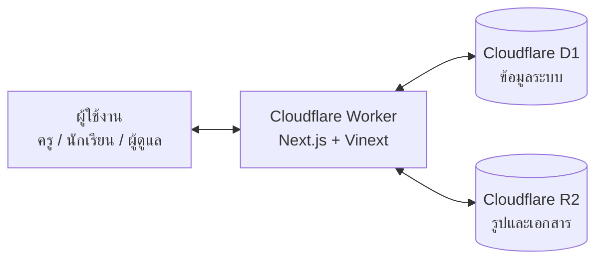
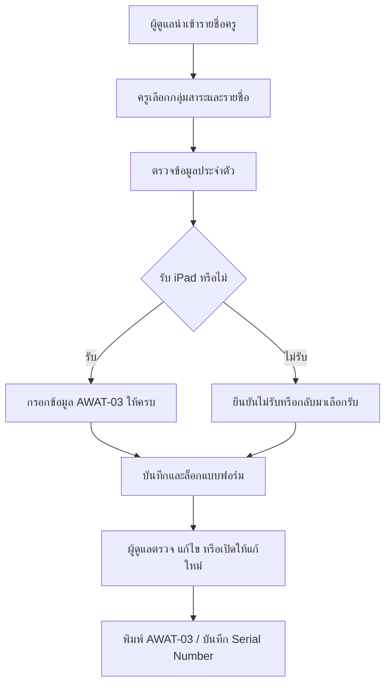
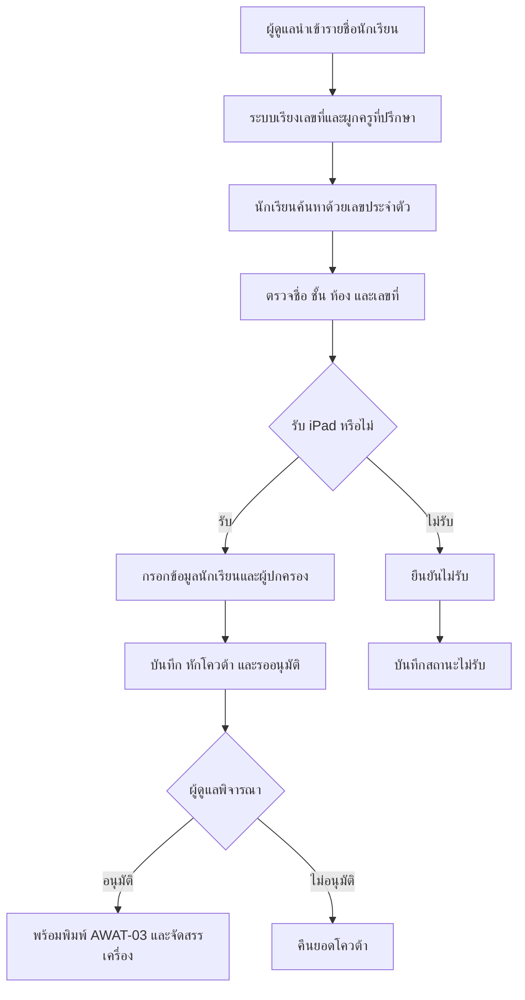
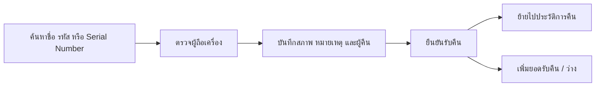

# 📘 คู่มือการใช้งานและติดตั้งระบบลงทะเบียนรับ iPad ยืมเรียน

เอกสารฉบับนี้จัดทำขึ้นเพื่อใช้เป็นแนวทางประกอบการอบรม การดำเนินงาน การติดตั้ง และการอ้างอิงระบบลงทะเบียนรับ iPad ยืมเรียนของโรงเรียนจอมทอง โดยเรียบเรียงตามลำดับการใช้งานจริง ตั้งแต่การเตรียมข้อมูล การเปิดลงทะเบียน การตรวจอนุมัติ การพิมพ์ AWAT-03 การจัดสรรและคืนเครื่อง ไปจนถึงการดูแลระบบบน Cloudflare

คู่มือนี้รวมทั้งส่วนของครู นักเรียน ผู้ดูแลระบบ ผู้ติดตั้ง และผู้รับผิดชอบด้านข้อมูลไว้ในไฟล์เดียว เพื่อให้สามารถนำไปใช้อบรม ติดตั้งระบบใหม่ หรือส่งต่องานได้โดยไม่ต้องอ้างอิงเอกสารหลายฉบับ

## 🌐 1. ภาพรวมของระบบ

ระบบลงทะเบียนรับ iPad ยืมเรียนเป็นเว็บแอปพลิเคชันสำหรับบริหารการรับอุปกรณ์ตามโครงการ Anywhere Anytime โดยเชื่อมงานของครู นักเรียน ผู้ดูแล และงานพัสดุไว้ในระบบเดียว ความสามารถหลักประกอบด้วย

- หน้าแรกสำหรับเลือกลงทะเบียนเป็นครู/บุคลากรหรือนักเรียน
- ครูค้นหารายชื่อจากกลุ่มสาระและยืนยันข้อมูลของตนเอง
- นักเรียนค้นหาด้วยเลขประจำตัวนักเรียน
- บันทึกความประสงค์รับหรือไม่รับ iPad
- ตรวจสอบโดเมนอีเมลโรงเรียน `@chomthong.ac.th` และ NDLP `@ndlp.go.th`
- ตรวจเลขประจำตัวประชาชน รูปแบบเบอร์โทร และข้อมูลที่จำเป็นตาม AWAT-03
- แยกช่วงเวลาเปิด–ปิดลงทะเบียนครู นักเรียน ม.ต้น และนักเรียน ม.ปลาย
- นับโควต้าครูและนักเรียน พร้อมสงวนโควต้า ม.ปลายตามรายชื่อ
- ผู้ดูแลอนุมัติหรือไม่อนุมัติการลงทะเบียนของนักเรียน
- พิมพ์ AWAT-03 รายบุคคลหรือเป็นชุด
- จัดการ Serial Number และบันทึกการคืน iPad ของทั้งครูและนักเรียน
- เก็บประวัติการคืนย้อนหลัง
- นำเข้า/ส่งออกรายชื่อและผลการลงทะเบียนด้วย CSV/XLSX
- กำหนดครูที่ปรึกษา 1–2 คนต่อห้อง และให้ครูหนึ่งคนดูแลได้หลายห้อง
- อัปโหลดประชาสัมพันธ์หลายไฟล์ต่อหัวข้อ แสดงภาพบนหน้าเว็บ และจัดลำดับด้วยการลาก
- เปลี่ยนโลโก้ ข้อความหน้าแรก ข้อมูลโครงการ ผู้อนุมัติ และค่าระบบจากหน้าแอดมิน
- จัดการผู้ดูแลระบบและตรวจ Audit Log
- Responsive สำหรับคอมพิวเตอร์ แท็บเล็ต และโทรศัพท์

## 🎯 2. เป้าหมายของระบบ

ระบบนี้ถูกออกแบบมาเพื่อแก้ปัญหา 6 เรื่องหลัก

1. ลดการใช้กระดาษและการกรอกข้อมูลเดิมซ้ำหลายครั้ง
2. ให้ครูและนักเรียนตรวจสอบข้อมูลของตนเองก่อนบันทึก
3. ให้ผู้ดูแลเห็นยอดลงทะเบียน โควต้า และผลอนุมัติแบบทันที
4. เชื่อมข้อมูลลงทะเบียนกับ AWAT-03, Serial Number และประวัติคืนเครื่อง
5. ลดความผิดพลาดจากโดเมนอีเมล เลขประจำตัวประชาชน เบอร์โทร และข้อมูลที่ไม่ครบ
6. รองรับการติดตั้งซ้ำในโรงเรียนอื่นโดยแยกค่าระบบ ข้อมูล และ Secret ออกจากโค้ด

## 👥 3. บทบาทผู้ใช้งาน

ระบบรองรับผู้ใช้งาน 4 กลุ่มหลัก

### 👩‍🏫 3.1 ครูและบุคลากร

- ค้นหารายชื่อจากกลุ่มสาระ
- ตรวจและเติมข้อมูลส่วนตัวที่ยังขาด
- เลือกรับหรือไม่รับ iPad
- บันทึกข้อมูลเพื่อจัดทำ AWAT-03
- กลับมาแก้ไขได้เมื่อผู้ดูแลเปิดแบบฟอร์มใหม่

### 🧑‍🎓 3.2 นักเรียน

- ยืนยันตัวตนด้วยเลขประจำตัวนักเรียน
- ตรวจชื่อ ชั้น ห้อง เลขที่ และครูที่ปรึกษา
- กรอกข้อมูลนักเรียนและผู้ปกครองตาม AWAT-03
- เลือกรับหรือไม่รับ iPad
- ส่งข้อมูลเพื่อรอผู้ดูแลอนุมัติ

### 🛡️ 3.3 ผู้ดูแลระบบ `admin`

- ดูแดชบอร์ดและรายการลงทะเบียน
- จัดการรายชื่อครู นักเรียน กลุ่มสาระ และครูที่ปรึกษา
- ตรวจ แก้ไข อนุมัติ เปิดให้ลงทะเบียนใหม่ และพิมพ์ AWAT-03
- จัดการประชาสัมพันธ์ การคืนเครื่อง การตั้งค่า และ Audit Log

### 👑 3.4 ผู้ดูแลระบบสูงสุด `superadmin`

มีสิทธิ์ทั้งหมดของ `admin` และสามารถเพิ่ม ปิดใช้งาน รีเซ็ตรหัสผ่าน หรือลบบัญชีผู้ดูแลระบบได้ ระบบไม่อนุญาตให้ลบ `superadmin` คนสุดท้าย

## 🗺️ 4. หน้าใช้งานหลักของระบบ

### 🌍 4.1 หน้าสาธารณะ

| หน้า | URL | ใช้ทำอะไร |
| --- | --- | --- |
| หน้าแรก | `/` | เลือกประเภทผู้ลงทะเบียนและดูภาพรวมโครงการ |
| ลงทะเบียนครู | `/teacher` | เลือกกลุ่มสาระ ค้นหารายชื่อ และลงทะเบียน |
| ลงทะเบียนนักเรียน | `/student` | ค้นหาด้วยเลขประจำตัวนักเรียนและลงทะเบียน |
| ประชาสัมพันธ์ | `/project` | ดูภาพ ข่าว เอกสาร และรายละเอียดโครงการ |
| เข้าสู่ระบบผู้ดูแล | `/admin/login` | ล็อกอินเข้าส่วนจัดการ; หากไม่เคลื่อนไหว 30 นาที ระบบออกจากระบบอัตโนมัติ |

### 🛠️ 4.2 หน้าภายในส่วนผู้ดูแล

| เมนู | URL | งานหลัก |
| --- | --- | --- |
| แดชบอร์ด | `/admin` | ดูภาพรวมครู/นักเรียนและสถานะโควต้า |
| ลงทะเบียนครู | `/admin/results` | ค้นหา ดูรายละเอียด แก้ไข เปิดให้แก้ใหม่ และพิมพ์ |
| ลงทะเบียนนักเรียน | `/admin/student-results` | กรองตามชั้น/ห้อง ตรวจข้อมูล อนุมัติ และพิมพ์ |
| จัดการครู | `/admin/teachers` | เพิ่ม แก้ไข ลบ และนำเข้ารายชื่อครู |
| จัดการนักเรียน | `/admin/students` | เพิ่ม แก้ไข ลบ และนำเข้ารายชื่อนักเรียน |
| กลุ่มสาระ | `/admin/learning-areas` | จัดการกลุ่มสาระการเรียนรู้ |
| ครูที่ปรึกษา | `/admin/advisors` | ผูกครูกับชั้นและห้อง |
| ประชาสัมพันธ์ | `/admin/documents` | เพิ่ม แก้ไข ลบ จัดลำดับรูปและเอกสาร |
| คืน iPad | `/admin/returns` | รับคืนเครื่องและดูประวัติย้อนหลัง |
| ตั้งค่า | `/admin/settings` | ตั้งค่าหน้าเว็บ โควต้า ช่วงเวลา โลโก้ และผู้อนุมัติ |
| Audit Log | `/admin/audit` | ตรวจประวัติการทำรายการ ครั้งละไม่เกิน 50 รายการ |
| จัดการผู้ดูแลระบบ | `/admin/admins` | เพิ่ม แก้ไข หรือลบผู้ดูแล (เฉพาะ superadmin) |

ผู้ดูแลทั่วไปใช้เมนูงานประจำ ส่วน `superadmin` จัดการบัญชีผู้ดูแลและงานที่มีความเสี่ยงสูงได้ ห้ามลบ superadmin คนสุดท้ายออกจากระบบ

## 🧱 5. เทคโนโลยีและสถาปัตยกรรม

### 🏗️ 5.1 โครงสร้างระดับสูง



### 🔩 5.2 ส่วนประกอบหลัก

- Next.js App Router, React และ TypeScript
- Vinext/Vite สำหรับสร้าง Cloudflare Worker
- Tailwind CSS
- Cloudflare D1 สำหรับข้อมูลเชิงโครงสร้าง
- Cloudflare R2 สำหรับโลโก้ รูปภาพ และเอกสารประชาสัมพันธ์
- Drizzle ORM และ D1 migrations
- Zod สำหรับตรวจข้อมูล
- Web Crypto API: AES-GCM, HMAC/SHA-256 และ PBKDF2
- Font Awesome และ Noto Sans Thai

Bindings ที่ Worker ต้องมี:

| Binding/Secret | ชนิด | หน้าที่ |
| --- | --- | --- |
| `DB` | D1 | ฐานข้อมูลหลัก |
| `FILES` | R2 | ไฟล์ประชาสัมพันธ์และโลโก้ |
| `ASSETS` | Worker Assets | ไฟล์หน้าเว็บที่ build แล้ว |
| `SESSION_SECRET` | Secret | ลงนาม token และข้อมูล session |
| `PII_ENCRYPTION_KEY` | Secret | เข้ารหัสข้อมูลส่วนบุคคล |
| `ADMIN_INITIAL_USERNAME` | Secret (ไม่บังคับ) | เปลี่ยนชื่อผู้ดูแล bootstrap จากค่าเริ่มต้น `admin` |
| `ADMIN_INITIAL_PASSWORD` | Secret (ไม่บังคับ) | เปลี่ยนรหัส bootstrap จากค่าเริ่มต้น `admin123456` |

ตารางสำคัญใน D1 ได้แก่ `teachers`, `students`, `survey_responses`, `student_survey_responses`, `device_assignments`, `student_device_assignments`, `class_advisors`, `device_return_history`, `project_documents`, `system_settings`, `admin_users`, `admin_sessions` และ `audit_logs`

### 🗄️ 5.3 ตารางข้อมูลสำคัญ

| ตาราง | หน้าที่ |
| --- | --- |
| `teachers` | รายชื่อและข้อมูลพื้นฐานครู/บุคลากร |
| `students` | รายชื่อนักเรียน ชั้น ห้อง และเลขที่ |
| `survey_responses` | การลงทะเบียนของครูและข้อมูล AWAT-03 |
| `student_survey_responses` | การลงทะเบียนและผลอนุมัติของนักเรียน |
| `device_assignments` | Serial Number ที่จัดสรรให้ครู |
| `student_device_assignments` | Serial Number ที่จัดสรรให้นักเรียน |
| `class_advisors` | ความสัมพันธ์ครูที่ปรึกษากับชั้น/ห้อง |
| `device_return_history` | ประวัติรับคืนและสภาพเครื่อง |
| `project_documents` | Metadata ประชาสัมพันธ์; ไฟล์จริงอยู่ R2 |
| `system_settings` | ข้อมูลโรงเรียน Hero โควต้า และช่วงเวลาเปิดลงทะเบียน |
| `admin_users` / `admin_sessions` | บัญชีและ session ผู้ดูแล |
| `audit_logs` | ประวัติการดำเนินงานสำคัญ |

> การเปิดเว็บไม่ได้สร้าง schema ให้อัตโนมัติ ต้องรัน migrations และ seed ตามคู่มือนี้ก่อนเสมอ วิธีนี้ป้องกันหลาย Worker cold start เขียน schema พร้อมกันในช่วงที่มีผู้ใช้จำนวนมาก

## 👩‍🏫 6. การเตรียมไฟล์รายชื่อครู

ระบบรับไฟล์ CSV และ XLSX แนะนำให้ดาวน์โหลด Template จากหน้า **จัดการครู → นำเข้ารายชื่อ** แล้วกรอกในไฟล์นั้น

| คอลัมน์ | จำเป็น | ตัวอย่าง/เงื่อนไข |
| --- | --- | --- |
| `prefix` / คำนำหน้า | ใช่ | นาย, นาง, นางสาว |
| `first_name` / ชื่อ | ใช่ | ไม่ใส่คำนำหน้าซ้ำในช่องชื่อ |
| `last_name` / นามสกุล | ใช่ | นามสกุลอย่างเดียว |
| `learning_area` / กลุ่มสาระ | ใช่ | ต้องตรงกับกลุ่มสาระ หรือยืนยันสร้างกลุ่มใหม่ตอนนำเข้า |
| `position` / ตำแหน่ง | ไม่บังคับ | ผู้บริหาร, ครู, ครูอัตราจ้าง |
| `academic_rank` / วิทยฐานะ | ไม่บังคับ | ไม่มีวิทยฐานะ, ชำนาญการ, ชำนาญการพิเศษ, เชี่ยวชาญ, เชี่ยวชาญพิเศษ |
| `email` / อีเมลโรงเรียน | ไม่บังคับตอนนำเข้า | ถ้ามีต้องลงท้าย `@chomthong.ac.th` |
| `ndlp_email` / อีเมล NDLP | ไม่บังคับตอนนำเข้า | ถ้ามีต้องลงท้าย `@ndlp.go.th` |
| `phone` / เบอร์โทรศัพท์ | ไม่บังคับตอนนำเข้า | รูปแบบเบอร์โทรไทย |

ไม่ต้องใส่รหัสบุคลากร ระบบสร้างรหัส `CT-...` ให้อัตโนมัติ ข้อมูลที่เว้นว่างจะถูกบังคับให้ครูกรอกให้ครบเมื่อลงทะเบียนรับ iPad

ก่อนนำเข้าให้ตรวจ:

1. ไม่มีแถวหัวตารางซ้ำหรือแถวว่างคั่นกลาง
2. ชื่อและนามสกุลไม่รวมอยู่ช่องเดียวกัน
3. คำนำหน้าไม่ซ้ำในช่องชื่อ
4. กลุ่มสาระสะกดเหมือนกันทั้งไฟล์
5. ไม่มีช่องว่างท้ายอีเมล
6. บันทึก CSV เป็น UTF-8 เพื่อไม่ให้ภาษาไทยเสีย

ระบบจับรายการเดิมจากคำนำหน้า ชื่อ นามสกุล และกลุ่มสาระ แล้วอัปเดตแทนการสร้างซ้ำ รองรับครั้งละไม่เกิน 3,000 แถว

## 🧑‍🎓 7. การเตรียมไฟล์รายชื่อนักเรียน

ระบบรับ CSV และ XLSX แนะนำให้ใช้ Template จากหน้า **จัดการนักเรียน → นำเข้ารายชื่อ**

| คอลัมน์ | จำเป็น | ตัวอย่าง/เงื่อนไข |
| --- | --- | --- |
| `studentCode` / รหัสนักเรียน | ใช่ | รหัสไม่ซ้ำ เช่น `23964` |
| `prefix` / คำนำหน้า | ใช่ | เด็กชาย, เด็กหญิง, นาย, นางสาว |
| `firstName` / ชื่อ | ใช่ | ไม่ใส่คำนำหน้าซ้ำ |
| `lastName` / นามสกุล | ใช่ | นามสกุลอย่างเดียว |
| `gradeLevel` / ระดับชั้น | ใช่ | มัธยมศึกษาปีที่ 1–6 หรือ M1–M6 |
| `room` / ห้อง | ใช่ | 1–13 |
| `birthDate` / วันเกิด | ไม่บังคับ | `YYYY-MM-DD` หรือ `DD/MM/YYYY`; ปี พ.ศ. แปลงให้อัตโนมัติ |
| `phone` / เบอร์โทรศัพท์ | ไม่บังคับ | เบอร์นักเรียน |
| `email` / อีเมลโรงเรียน | ไม่บังคับ | ถ้ามีต้องลงท้าย `@chomthong.ac.th` |
| `ndlpEmail` / อีเมล NDLP | ไม่บังคับ | ถ้ามีต้องลงท้าย `@ndlp.go.th` |

ระบบรองรับชื่อหัวคอลัมน์ภาษาไทย เช่น `เลขประจำตัวนักเรียน`, `ระดับชั้น`, `ห้อง`, `วันเกิด`, `เบอร์โทรศัพท์`, `อีเมลโรงเรียน` และ `อีเมล NDLP`

หลังนำเข้าระบบจะ:

1. อัปเดตรายการเดิมที่มีรหัสนักเรียนตรงกัน
2. เพิ่มรายการที่ยังไม่มี
3. เรียงเลขที่ใหม่แยกตามห้อง
4. เรียงนักเรียนชายก่อน แล้วเรียงตามเลขประจำตัวนักเรียน
5. เชื่อมครูที่ปรึกษาตามชั้น/ห้องโดยอัตโนมัติ

รองรับครั้งละไม่เกิน 3,000 แถว หากมีมากกว่านี้ให้แบ่งเป็นหลายไฟล์

## 🔄 8. กระบวนการทำงานของระบบ

ส่วนนี้อธิบายลำดับงานตั้งแต่เตรียมรายชื่อจนถึงคืนเครื่อง เพื่อให้ผู้รับผิดชอบแต่ละฝ่ายเข้าใจว่างานของตนเชื่อมกับส่วนใด

### 👩‍🏫 8.1 กระบวนการลงทะเบียนของครูและบุคลากร



หลักการสำคัญ:

- ครูต้องมีรายชื่อในระบบก่อนจึงลงทะเบียนได้
- ข้อมูลที่ไม่ได้ใส่มาตอนนำเข้าจะถูกบังคับให้กรอกเมื่อเลือกรับ
- เมื่อบันทึกสำเร็จ แบบฟอร์มถูกล็อกและนับโควต้าทันที
- การเปิดให้แก้ใหม่ต้องดำเนินการโดยผู้ดูแลและถูกบันทึกใน Audit Log

### 🧑‍🎓 8.2 กระบวนการลงทะเบียนและอนุมัตินักเรียน



หลักการสำคัญ:

- ใช้เลขประจำตัวนักเรียนยืนยันเบื้องต้น ไม่แสดงรายชื่อทั้งหมดต่อสาธารณะ
- ระบบผูกครูที่ปรึกษาจากชั้นและห้องโดยอัตโนมัติ
- การลงทะเบียนรับหักโควต้าทันที ส่วนการไม่อนุมัติคืนยอดให้โดยอัตโนมัติ
- โควต้า ม.ปลายสงวนตามรายชื่อที่เปิดใช้งาน และแยกจากยอดที่ ม.ต้น ใช้ได้

### 📄 8.3 กระบวนการ AWAT-03 และการจัดสรรเครื่อง

1. ผู้ดูแลเปิดรายละเอียดผู้ลงทะเบียน
2. ตรวจข้อมูลส่วนบุคคล ที่อยู่ อีเมล เบอร์โทร ผู้ปกครอง และผู้อนุมัติ
3. ถ้าข้อมูลผิด ให้แก้จากหน้าแอดมินหรือเปิดให้เจ้าของข้อมูลแก้ใหม่
4. กด **พิมพ์ AWAT-03** แบบรายบุคคล หรือใช้ **Batch Print** ตามตัวกรอง
5. เมื่อตรวจเครื่องจริงแล้วจึงบันทึก Serial Number ให้ตรงกับผู้รับ
6. การบันทึก Serial Number ไม่ใช่จุดหักโควต้า เพราะระบบหักตั้งแต่ลงทะเบียนรับแล้ว

### 🔁 8.4 กระบวนการคืน iPad



ประวัติการคืนไม่ควรถูกลบเพื่อแก้ยอด หากบันทึกผิดให้ตรวจ Audit Log และแก้ตามกระบวนการของผู้ดูแลระบบ

### 📣 8.5 กระบวนการประชาสัมพันธ์

1. สร้างหัวข้อและคำอธิบาย
2. เลือกรูปหลายรูปหรือ PDF
3. ตรวจภาพตัวอย่างและลากเรียงลำดับ
4. เปิดสถานะ **เผยแพร่บนหน้าเว็บ**
5. บันทึก แล้วตรวจหน้า `/project`
6. เมื่อแก้ไข ระบบแสดงไฟล์เดิมเพื่อให้เพิ่ม ลบ เปลี่ยน หรือจัดลำดับใหม่ได้

## ⚙️ 9. ตั้งค่าระบบครั้งแรก

เข้าสู่ระบบแล้วเปิด **ตั้งค่า** จากนั้นกรอกชื่อระบบ/โครงการ ข้อมูลโรงเรียน ยี่ห้อ/รุ่น โลโก้ ผู้อนุมัติครู ผู้อนุมัตินักเรียน ข้อความ Hero ข้อความประกาศ โควต้า และช่วงเวลาลงทะเบียน

ระบบคำนวณสถานะจากสวิตช์และช่วงเวลา หากไม่ได้กำหนดเวลา ระบบใช้สถานะจากสวิตช์ เมื่อบันทึกสำเร็จฟอร์มจะถูกล็อกเพื่อป้องกันการแก้โดยไม่ตั้งใจ ให้กด **แก้ไขการตั้งค่า** ด้านล่างก่อนจึงแก้และบันทึกใหม่ได้

ลำดับเตรียมระบบที่แนะนำ:

1. ตั้งค่าข้อมูลโรงเรียน โควต้า และผู้อนุมัติ
2. ตรวจหรือเพิ่มกลุ่มสาระ
3. นำเข้ารายชื่อครู
4. นำเข้ารายชื่อนักเรียน
5. กำหนดครูที่ปรึกษา
6. เพิ่มประชาสัมพันธ์
7. ตรวจหน้าเว็บและ AWAT-03
8. กำหนดเวลาเปิดลงทะเบียน

## 👩‍🏫 10. คู่มือสำหรับครูและบุคลากร

### 🔎 10.1 ค้นหาและตรวจสอบรายชื่อ

1. เปิดหน้าแรกแล้วเลือก **ครูและบุคลากร**
2. เลือกกลุ่มสาระ ค้นหา และเลือกรายชื่อของตนเอง
3. ตรวจชื่อ กลุ่มสาระ และข้อมูลที่ระบบแสดง

ถ้าไม่พบชื่อ ห้ามเลือกรายชื่อของบุคคลอื่น ให้ติดต่อผู้ดูแลเพื่อตรวจกลุ่มสาระ สถานะเปิดใช้งาน และการสะกดชื่อ

### 📱 10.2 เลือกความประสงค์และกรอกข้อมูล

1. เลือก **รับ iPad** หรือ **ไม่รับ iPad**
2. ถ้าเลือกรับ ให้กรอกตำแหน่ง วิทยฐานะ อีเมลโรงเรียน อีเมล NDLP เบอร์โทร เลขประจำตัวประชาชน และที่อยู่ที่ยังขาด
3. อ่านเงื่อนไข ตรวจข้อมูลอีกครั้ง แล้วบันทึก
4. รอข้อความยืนยันว่าระบบบันทึกสำเร็จและล็อกแบบฟอร์มแล้ว

### ✏️ 10.3 เมื่อต้องการแก้ข้อมูล

หลังบันทึก ครูไม่สามารถแก้ข้อมูลเองได้ ให้แจ้งผู้ดูแลเลือก **เปิดให้ครูแก้ไข** จากหน้ารายละเอียด จากนั้นกลับเข้าหน้าลงทะเบียน เลือกรายชื่อเดิม แก้ข้อมูล และบันทึกใหม่

ข้อควรทราบ:

- อีเมลโรงเรียนต้องลงท้าย `@chomthong.ac.th`
- อีเมล NDLP ต้องลงท้าย `@ndlp.go.th`; หากลืมให้ติดต่อครูวิทยาหรือครูธนา
- หลังบันทึก แบบฟอร์มจะถูกล็อก ผู้ดูแลสามารถเปิดให้แก้ใหม่ได้
- หากเลือกไม่รับ ระบบแสดงข้อความขอความอนุเคราะห์ให้รับอุปกรณ์ และยังกลับมาเลือกรับได้ก่อนยืนยัน

## 🧑‍🎓 11. คู่มือสำหรับนักเรียน

### 🪪 11.1 ค้นหาและยืนยันข้อมูลนักเรียน

1. เปิดหน้าแรกแล้วเลือก **นักเรียน**
2. กรอกเลขประจำตัวนักเรียนเพื่อค้นหา
3. ตรวจชื่อ ระดับชั้น ห้อง เลขที่ และครูที่ปรึกษา

หากชื่อ ชั้น ห้อง เลขที่ หรือครูที่ปรึกษาไม่ถูกต้อง ให้หยุดและแจ้งครูที่ปรึกษาหรือผู้ดูแลก่อนบันทึก

### 📝 11.2 กรอกข้อมูล AWAT-03

1. เลือก **รับ iPad** หรือ **ไม่รับ iPad**
2. ถ้าเลือกรับ ให้กรอกข้อมูลนักเรียนตาม AWAT-03 ให้ครบ
3. กรอกเลขประจำตัวประชาชน เบอร์โทร อีเมลโรงเรียน และอีเมล NDLP ของนักเรียน
4. กรอกชื่อ–นามสกุลและเบอร์โทรผู้ปกครอง โดยไม่ต้องกรอกเลขประจำตัวประชาชนผู้ปกครอง
5. ตรวจที่อยู่ตามทะเบียนบ้าน โดยเฉพาะตำบล อำเภอ จังหวัด และรหัสไปรษณีย์
6. ยอมรับเงื่อนไข บันทึก และรอผู้ดูแลอนุมัติ

### ✅ 11.3 สถานะหลังบันทึก

- **รออนุมัติ** หมายถึงข้อมูลส่งแล้วและหักโควต้าไว้ แต่ผู้ดูแลยังไม่พิจารณา
- **อนุมัติ** หมายถึงผ่านการตรวจและพร้อมดำเนินการเอกสาร/จัดสรรเครื่อง
- **ไม่อนุมัติ** หมายถึงคำขอไม่ผ่านและระบบคืนยอดโควต้า
- **เปิดให้ลงทะเบียนใหม่** หมายถึงผู้ดูแลปลดล็อกแบบฟอร์มให้นักเรียนกลับมาแก้หรือส่งใหม่ได้

ข้อควรทราบ:

- กรอกคำนำหน้าผู้ปกครองรวมกับชื่อ เช่น `นายสมชาย ใจดี`
- ห้ามใส่คำนำหน้าซ้ำ เช่น `นาย นายสมชาย`
- อีเมลใช้กติกาโดเมนเดียวกับครู
- นักเรียน ม.ปลายที่เลือกไม่รับจะเห็นข้อความขอความอนุเคราะห์ให้รับ iPad เช่นเดียวกับครู
- เมื่อผู้ดูแลเปิดให้ลงทะเบียนใหม่ ระบบจะคืนสถานะแบบฟอร์มให้กรอกอีกครั้ง

## 👑 12. คู่มือสำหรับผู้ดูแลระบบ

### 📊 12.1 แดชบอร์ด

1. สลับแท็บ **ครูและบุคลากร** หรือ **นักเรียน**
2. ตรวจยอดทั้งหมด ลงทะเบียนแล้ว รับ ไม่รับ ยังไม่ลงทะเบียน และจำนวนเครื่องคงเหลือ
3. ตรวจกราฟแยกตามกลุ่มสาระหรือระดับชั้นเพื่อหากลุ่มที่ยังตอบน้อย
4. กดเมนูลงทะเบียนที่เกี่ยวข้องเพื่อดูรายบุคคล

### 👥 12.2 จัดการครูและนักเรียน

1. ใช้ช่องค้นหาและตัวกรองก่อนแก้ข้อมูลจำนวนมาก
2. เพิ่มรายบุคคล หรือกด **นำเข้ารายชื่อ** เพื่ออัปโหลด CSV/XLSX
3. ตรวจ preview, รายการซ้ำ และข้อผิดพลาดทุกแถวก่อนยืนยัน
4. หลังนำเข้าให้ตรวจยอดรวมและสุ่มเปิดรายละเอียดอย่างน้อยหนึ่งรายการต่อชั้น/กลุ่มสาระ
5. นักเรียนเรียงเลขที่อัตโนมัติโดยเพศชายก่อน แล้วเรียงรหัสภายในห้อง
6. ตารางแสดงครั้งละ 50 รายการและใช้ pagination เมื่อมีข้อมูลมากกว่า
7. เปิดรายละเอียดเพื่อดูข้อมูลที่ซ่อนจากตาราง เช่น ครูที่ปรึกษา อีเมล และข้อมูลลงทะเบียน

### ✅ 12.3 ตรวจการลงทะเบียน

**ครูและบุคลากร**

1. กรองกลุ่มสาระและสถานะ
2. กดรายละเอียดเพื่อตรวจข้อมูล อีเมล และที่อยู่
3. แก้ไข เปิดให้ครูแก้ใหม่ บันทึก Serial Number หรือพิมพ์ AWAT-03 ตามงานที่ต้องทำ

**นักเรียน**

1. กรองระดับชั้น ห้อง สถานะการลงทะเบียน และผลอนุมัติ
2. เปิดรายละเอียดเพื่อตรวจข้อมูลนักเรียน ผู้ปกครอง และครูที่ปรึกษา
3. กดอนุมัติเมื่อข้อมูลครบ หรือไม่อนุมัติพร้อมดำเนินการตามระเบียบของโรงเรียน
4. เมื่อไม่อนุมัติ ระบบคืนยอดโควต้าให้อัตโนมัติ

ทั้งสองส่วนดาวน์โหลดสรุป CSV, XLSX และพิมพ์ AWAT-03 รายบุคคลหรือเป็นชุดได้ ไฟล์ส่งออกถือเป็นข้อมูลอ่อนไหวและต้องเก็บในพื้นที่จำกัดสิทธิ์

### 🧑‍🏫 12.4 ครูที่ปรึกษา

1. เลือกระดับชั้นและห้อง
2. พิมพ์ชื่อเพื่อค้นหาครูแบบ instant
3. เลือกครูที่ปรึกษาคนที่ 1 ซึ่งเป็นข้อมูลบังคับ
4. เลือกคนที่ 2 ถ้าห้องนั้นมีครูสองคน
5. กดบันทึกและตรวจรายชื่อในตาราง

หนึ่งห้องมีครูที่ปรึกษา 1–2 คน และครูหนึ่งคนดูแลได้หลายห้อง นักเรียนที่เพิ่มหรือย้ายเข้าจะเชื่อมตามชั้น/ห้องโดยอัตโนมัติ

### 📣 12.5 ประชาสัมพันธ์

1. กดเพิ่มประชาสัมพันธ์ แล้วกรอกชื่อเรื่องและคำอธิบาย
2. เลือก JPG, PNG, WebP, GIF หรือ PDF ได้หลายไฟล์ในหัวข้อเดียว
3. ตรวจ preview และลากเรียงไฟล์ก่อน–หลัง
4. เปิดสวิตช์เผยแพร่แล้วบันทึก
5. ลากจัดลำดับหัวข้อบนหน้าแอดมินเพื่อกำหนดลำดับหน้าเว็บ
6. เมื่อต้องแก้ ให้กดแก้ไข ระบบจะแสดงไฟล์เดิมเพื่อเพิ่ม ลบ เปลี่ยน หรือจัดลำดับใหม่
7. เมื่อลบหรือแทนไฟล์ ระบบลบ object เดิมใน R2 และอัปเดตข้อมูลใน D1

ตัวแอปไม่กำหนดเพดานขนาดไฟล์ประชาสัมพันธ์เอง แต่ยังอยู่ภายใต้ขีดจำกัด request และ storage ของแผน Cloudflare ควรย่อรูปสำหรับเว็บเพื่อลดเวลาโหลดและค่าใช้จ่าย

### 🔁 12.6 คืน iPad

1. เปิดแท็บ **เครื่องที่จัดสรรอยู่**
2. ค้นหาจากชื่อ รหัส หรือ Serial Number ของครูหรือนักเรียน
3. ตรวจผู้ถือเครื่องและ Serial Number ให้ตรงกับเครื่องจริง
4. บันทึกผู้คืน สภาพเครื่อง หมายเหตุ และผู้ดำเนินการ
5. ยืนยันรับคืน ระบบเพิ่มจำนวน **รับคืน/ว่าง** และย้ายรายการไปแท็บ **ประวัติการคืน**

### 🛡️ 12.7 จัดการผู้ดูแลระบบ

เฉพาะ `superadmin` สามารถเพิ่มบัญชี กำหนดชื่อแสดงผล บทบาท สถานะ และรีเซ็ตรหัสผ่านได้ ควรสร้างบัญชีแยกให้ผู้ปฏิบัติงานทุกคน ไม่ควรแชร์บัญชีเดียวกัน เพราะ Audit Log จะระบุตัวผู้ทำรายการไม่ได้

### 📋 12.8 Audit Log

- ตรวจประวัติการดู แก้ไข อนุมัติ ส่งออก ลบ และงานสำคัญอื่น
- แสดงครั้งละไม่เกิน 50 รายการ และกดเปลี่ยนหน้าเองเมื่อมีข้อมูลมากกว่า
- ใช้ตัวกรองเพื่อจำกัดช่วงข้อมูลก่อนตรวจสอบ
- Audit Log ใช้ตรวจย้อนหลัง ไม่ควรแก้หรือลบเพื่อปกปิดการดำเนินงาน

## 📦 13. กติกาโควต้าและสถานะ

### 👩‍🏫 13.1 ครูและบุคลากร

- โควต้าตั้งจากหน้า **ตั้งค่า**
- เมื่อบันทึกรับ iPad และแบบฟอร์มถูกล็อก ระบบนับว่าใช้โควต้าแล้ว
- ไม่ต้องรอ Serial Number จึงจะหักยอด

### 🧑‍🎓 13.2 นักเรียน

- ลงทะเบียนรับ iPad แล้วหักยอดทันที ไม่ต้องรอ Serial Number
- นักเรียนยังมีสถานะรอผู้ดูแลอนุมัติ
- ถ้าผู้ดูแลไม่อนุมัติ ระบบคืนยอดโควต้า
- ม.ปลายถูกสงวนโควต้าตามรายชื่อนักเรียนที่เปิดใช้งานก่อน
- โควต้า ม.ต้นคำนวณจากโควต้านักเรียนรวมลบจำนวนที่สงวนให้ ม.ปลาย
- หน้าลงทะเบียนแสดงจำนวนเครื่องคงเหลือ

ก่อนเปิดจริงควรตรวจจำนวนรายชื่อ ม.ปลายกับจำนวนจัดสรร และทดสอบกรณีลงทะเบียน อนุมัติ ไม่อนุมัติ เปิดให้ลงทะเบียนใหม่ และคืนเครื่องอย่างละหนึ่งรายการ

## 💾 14. สำรองและกู้คืนข้อมูล

### 🗄️ 14.1 สำรอง D1

```bash
npx wrangler d1 export ipad --remote --output backup-ipad-YYYY-MM-DD.sql
```

ตั้งชื่อไฟล์ให้มีวันที่จริงและเก็บนอกเครื่องพัฒนาอย่างน้อยหนึ่งชุด ไฟล์สำรองมีข้อมูลส่วนบุคคล ต้องเข้ารหัสและจำกัดสิทธิ์เข้าถึง

### ♻️ 14.2 กู้คืนไปฐานใหม่

วิธีปลอดภัยคือสร้างฐานใหม่ก่อน แล้ว import ไฟล์สำรอง จากนั้นเปลี่ยน `database_id` และตรวจระบบก่อนสลับใช้งานจริง

```bash
npx wrangler d1 create ipad-restore
npx wrangler d1 execute ipad-restore --remote --file=./backup-ipad-YYYY-MM-DD.sql
```

อย่า import ทับ production โดยไม่มีสำเนาสำรองและแผนย้อนกลับ

### 🗂️ 14.3 สำรอง R2 และ Secret

D1 เก็บ metadata แต่ไฟล์จริงอยู่ R2 การสำรอง D1 อย่างเดียวไม่พอ ควรสำรอง bucket ด้วย Cloudflare Dashboard หรือเครื่องมือ S3-compatible/rclone และเก็บ `PII_ENCRYPTION_KEY` ไว้ในที่ปลอดภัยแยกจาก SQL

## 🔐 15. ความปลอดภัยและข้อมูลส่วนบุคคล

- ข้อมูลส่วนบุคคลสำคัญถูกเข้ารหัส AES-GCM ก่อนเก็บ D1
- รหัสผ่านใช้ PBKDF2 แบบมี salt และรวมการคำนวณ 300,000 รอบสำหรับบัญชีใหม่
- Admin session ฝั่งเซิร์ฟเวอร์หมดอายุเมื่อไม่มีการเคลื่อนไหวเกิน 30 นาที และหน้าเว็บจะพากลับไปหน้าเข้าสู่ระบบอัตโนมัติ
- Cookie เป็น HttpOnly, SameSite=Lax และ Secure เมื่อใช้ HTTPS
- Write API ตรวจ origin, validation และ rate limit
- Public API ไม่ส่งเลขประชาชน ที่อยู่ hash รหัสผ่าน หรือข้อมูลผู้ดูแล
- การดู แก้ไข อนุมัติ ส่งออก และลบข้อมูลสำคัญถูกบันทึก Audit Log
- Full export และไฟล์สำรองถือเป็นข้อมูลอ่อนไหว ห้ามส่งผ่านช่องทางสาธารณะ

## 🚦 16. การรองรับผู้ใช้พร้อมกัน

Worker มี cache สำหรับข้อมูลสาธารณะและรวมคำขอที่กำลังดึงข้อมูลเดียวกันเพื่อลด query ซ้ำต่อ D1 ระบบไม่รัน migration ตอน request จึงลดความเสี่ยงเมื่อมีผู้ใช้ 300–400 คนเปิดพร้อมกัน

ทดสอบ local preview:

```bash
npm run build
npm start
```

อีก Terminal:

```bash
npm run test:load
```

กำหนดเป้าหมายและจำนวนเองได้:

```bash
BASE_URL=https://ipad.example.ac.th USERS=400 CONCURRENCY=400 REQUEST_TIMEOUT_MS=15000 npm run test:load
```

ทดสอบ production เฉพาะเมื่อได้รับอนุญาต ใช้ช่วงเวลาที่ไม่กระทบผู้ใช้ และเฝ้าดู Workers Analytics, Errors, D1 queries และ R2 operations

## ⌨️ 17. คำสั่งที่ใช้บ่อย

| คำสั่ง | ความหมาย |
| --- | --- |
| `npm install` | ติดตั้ง dependencies |
| `npm run dev` | เปิด dev server ที่พอร์ต 3000 |
| `npm run build` | สร้าง Worker และ assets |
| `npm start` | เปิด Worker preview ในเครื่อง |
| `npm run lint` | ตรวจ lint |
| `npm run test` | Build และทดสอบ rendered HTML |
| `npm run test:load` | ทดสอบคำขอสาธารณะพร้อมกัน |
| `npm run db:migrate:local` | ใช้ migrations กับ D1 local binding `DB` |
| `npm run db:seed:local` | ใส่ข้อมูลตั้งต้นใน D1 local |
| `npm run db:migrate:remote` | ใช้ migrations กับ D1 production |
| `npm run db:seed:remote` | ใส่ข้อมูลตั้งต้นใน D1 production |
| `npm run db:generate` | สร้าง Drizzle migration ใหม่ |
| `npm run deploy` | Build และ Deploy ไป Cloudflare |
| `npx wrangler whoami` | ตรวจบัญชี Cloudflare ปัจจุบัน |

## 📁 18. โครงสร้างโครงการ

```text
app/                  หน้า Next.js และ API routes
components/public/    หน้าลงทะเบียนและประชาสัมพันธ์
components/admin/     Dashboard, CRUD, import, settings และ print
db/schema.ts          Drizzle schema
lib/auth/             Admin authentication และ session
lib/db/               D1 runtime และ queries
lib/security/         Encryption, hashing, origin และ rate limit
lib/validation/       Validation และ Thai citizen ID checksum
migrations/           D1 migrations และ seed
public/               Static assets และ AWAT assets
scripts/              Build, preview และ load test
tests/                Automated tests
worker/index.ts       Cloudflare Worker entry
wrangler.example.jsonc  ตัวอย่าง Worker, D1, R2 และ assets bindings
.dev.vars.example     ตัวอย่างตัวแปรลับสำหรับ local (ไม่มีค่าจริง)
```

## 🚀 19. คู่มือติดตั้งและเผยแพร่ระบบแบบทำตามทีละขั้น

ส่วนนี้อยู่ช่วงท้ายของคู่มือเพื่อให้ผู้อ่านทำความเข้าใจระบบและเตรียมข้อมูลก่อนเริ่มติดตั้ง เนื้อหาครอบคลุมทั้งการเปิดระบบในเครื่อง การสร้างทรัพยากร Cloudflare และการเผยแพร่ระบบจริง

> คำสั่งทุกชุดในส่วนนี้ให้พิมพ์ใน **Terminal** (macOS/Linux) หรือ **PowerShell** (Windows) ภายในโฟลเดอร์โครงการ เว้นแต่หัวข้อนั้นจะระบุให้ทำใน Cloudflare Dashboard

### 🧭 19.1 ทำความเข้าใจก่อนเริ่ม

ระบบประกอบด้วยทรัพยากรหลัก 3 ส่วน:

| ส่วน | หน้าที่ | ชื่อที่แนะนำ |
| --- | --- | --- |
| Cloudflare Worker | รันเว็บไซต์และ API | `ipad` |
| Cloudflare D1 | เก็บข้อมูลครู นักเรียน การลงทะเบียน และการตั้งค่า | `ipad` |
| Cloudflare R2 | เก็บโลโก้ รูป และเอกสารประชาสัมพันธ์ | `ipad-documents` |

ชื่อทรัพยากรเปลี่ยนได้ แต่ชื่อ binding ในโค้ดต้องคงเป็น:

- `DB` สำหรับ D1
- `FILES` สำหรับ R2

คำอธิบายคำสั่งที่พบบ่อย:

- `npm install` ดาวน์โหลดไลบรารีที่โครงการต้องใช้
- `npm run dev` เปิดระบบสำหรับพัฒนาในเครื่อง
- `npx wrangler ...` สั่งงาน Cloudflare จาก Terminal
- `npm run db:migrate:*` สร้างหรือปรับโครงสร้างตารางฐานข้อมูล
- `npm run db:seed:*` เพิ่มข้อมูลตั้งต้นที่ระบบจำเป็นต้องใช้
- `npm run deploy` สร้างและเผยแพร่ Worker ขึ้น Cloudflare

### ✅ 19.2 สิ่งที่ต้องเตรียม

บัญชีและเครื่องมือ:

- บัญชี Cloudflare ที่เปิดใช้งาน Workers, D1 และ R2 ได้
- Git สำหรับดาวน์โหลดและอัปเดตโค้ด
- Node.js `22.13.0` ขึ้นไป ซึ่งติดตั้ง npm มาด้วย
- OpenSSL สำหรับสร้าง secret แบบสุ่มบน macOS/Linux; Windows ใช้ PowerShell สร้าง secret ได้โดยไม่ต้องติดตั้ง OpenSSL
- Chrome, Edge, Firefox หรือ Safari สำหรับทดสอบหน้าเว็บ
- โปรแกรมแก้ไขข้อความ เช่น Visual Studio Code

ข้อมูลของสถานศึกษา:

- ชื่อระบบ ชื่อโครงการ และข้อความ Hero
- ชื่อโรงเรียน ที่อยู่ และหน่วยงานต้นสังกัด
- โลโก้โรงเรียนชนิด JPG, PNG หรือ WebP
- ยี่ห้อและรุ่น iPad
- โควต้าเครื่องสำหรับครู นักเรียน ม.ต้น และนักเรียน ม.ปลาย
- ชื่อผู้อนุมัติเอกสารครูและนักเรียน ซึ่งตั้งแยกกันได้
- วันและเวลาเปิด–ปิดลงทะเบียนแต่ละกลุ่ม
- ไฟล์รายชื่อครู นักเรียน กลุ่มสาระ และครูที่ปรึกษา
- รูปหรือ PDF สำหรับประชาสัมพันธ์

ตรวจโปรแกรมใน Terminal:

```bash
git --version
node --version
npm --version
openssl version
```

หาก `node --version` ต่ำกว่า `22.13.0` ให้ติดตั้ง Node.js รุ่น LTS ใหม่ก่อนดำเนินการต่อ

บน Windows PowerShell ให้ตรวจด้วยคำสั่งนี้แทน โดยไม่ต้องมี OpenSSL:

```powershell
git --version
node --version
npm.cmd --version
$PSVersionTable.PSVersion
```

แนะนำ Windows 10/11 แบบ 64-bit, PowerShell 5.1 ขึ้นไป และ Node.js รุ่น LTS ที่มีเวอร์ชันไม่น้อยกว่า `22.13.0`

### 📥 19.3 ดาวน์โหลดโค้ดและเข้าโฟลเดอร์โครงการ

เปิด Terminal แล้วเลือกโฟลเดอร์ที่ต้องการเก็บโครงการ จากนั้นรัน:

```bash
git clone https://github.com/cboontact/code-ipad-ct.git
cd code-ipad-ct
npm install
```

อธิบายทีละบรรทัด:

1. `git clone ...` ดาวน์โหลดโค้ดจาก GitHub ลงเครื่อง
2. `cd code-ipad-ct` เข้าไปในโฟลเดอร์โครงการ
3. `npm install` ติดตั้ง dependencies ตาม `package-lock.json`

ตรวจว่าอยู่ถูกโฟลเดอร์:

```bash
pwd
ls
```

ควรเห็นไฟล์ `package.json`, `wrangler.example.jsonc`, โฟลเดอร์ `app` และโฟลเดอร์ `migrations`

บน Windows PowerShell ใช้คำสั่งนี้ตรวจแทน `pwd` และ `ls` ได้:

```powershell
Get-Location
Get-ChildItem
```

ควรเก็บโครงการใน path สั้นที่ไม่ถูก OneDrive ซิงก์ เช่น `C:\webapps\code-ipad-ct` เพื่อลดปัญหาไฟล์ถูกล็อก path ยาว และการ build ช้า

### 🏫 19.4 ปรับระบบให้เป็นข้อมูลของโรงเรียนตนเอง

ระบบมีข้อมูลโรงเรียนอยู่ 2 ประเภท จึงต้องแก้ให้ถูกจุด:

1. **ข้อมูลที่แก้ผ่านหน้าแอดมินได้** เหมาะสำหรับข้อมูลที่อาจเปลี่ยนระหว่างใช้งาน
2. **ค่าเริ่มต้นและข้อความสำรองในโค้ด** ต้องแก้ก่อน build หากนำโครงการไปใช้กับโรงเรียนอื่น

#### ข้อมูลที่แก้ผ่านหน้าแอดมิน

หลังติดตั้งและเข้าสู่ระบบ ให้เปิดเมนูตามตารางนี้ ไม่ต้องแก้โค้ด:

| เมนู | ข้อมูลที่ต้องเปลี่ยนเป็นของโรงเรียน |
| --- | --- |
| **ตั้งค่า → ข้อมูลระบบและโครงการ** | ชื่อระบบ ชื่อโครงการ ชื่อโรงเรียน ตำบล อำเภอ จังหวัด หน่วยงานต้นสังกัด ยี่ห้อและรุ่นอุปกรณ์ |
| **ตั้งค่า → Hero หน้าแรก** | ข้อความหัวเรื่อง ข้อความเน้น ป้าย “ฟรี” กลุ่มเป้าหมาย และปุ่มรายละเอียด |
| **ตั้งค่า → โควต้าอุปกรณ์** | จำนวนครู นักเรียน ม.ต้น และนักเรียน ม.ปลาย |
| **ตั้งค่า → ผู้ลงนามอนุมัติ** | ชื่อผู้อนุมัติเอกสารครูและนักเรียน ซึ่งกำหนดแยกกัน |
| **ตั้งค่า → การเปิดรับลงทะเบียน** | สถานะและวัน–เวลาเปิด–ปิดของครู นักเรียน ม.ต้น และนักเรียน ม.ปลาย |
| **ตั้งค่า → โลโก้โรงเรียน** | อัปโหลดโลโก้ JPG, PNG หรือ WebP ของโรงเรียน |
| **กลุ่มสาระ** | เพิ่ม ลบ ปิดใช้งาน และจัดลำดับกลุ่มสาระของโรงเรียน |
| **ประชาสัมพันธ์** | อัปโหลดรูปหลายรูปหรือ PDF จัดลำดับ และกำหนดการเผยแพร่ |
| **จัดการผู้ดูแลระบบ** | สร้างบัญชีผู้ปฏิบัติงานจริง แล้วลบบัญชีเริ่มต้น `admin` |

#### ไฟล์ที่ควรตรวจและแก้ก่อนสร้างฐานข้อมูล

| ไฟล์ | สิ่งที่ต้องแก้ | หมายเหตุ |
| --- | --- | --- |
| `migrations/seed.sql` | `system_name`, `project_name`, `school_name`, ที่ตั้ง หน่วยงาน รุ่นอุปกรณ์ ข้อความ Hero และสถานะเริ่มต้น | มีผลตอน seed ฐานข้อมูลใหม่เท่านั้น เพราะใช้ `INSERT OR IGNORE` |
| `lib/db/runtime.ts` | ชื่อระบบ โรงเรียน ที่ตั้ง และข้อความ Hero สำรอง | ใช้เมื่อฐานข้อมูลยังอ่านค่าไม่ได้หรือไม่มี key นั้น |
| `lib/validation/email-domains.ts` | `SCHOOL_EMAIL_DOMAIN`, `SCHOOL_EMAIL_PATTERN` และโดเมน NDLP หากหน่วยงานใช้โดเมนอื่น | ต้องแก้ทั้งค่าตรวจสอบและ regex ให้ตรงกัน |
| `app/layout.tsx` | ชื่อหน้าเว็บ คำอธิบาย Open Graph ชื่อโรงเรียน และ path รูปตัวอย่างเวลาแชร์ | ใช้กับ Google, Facebook และ LINE preview |
| `components/site-header.tsx` | ชื่อโรงเรียนและหน่วยงานสำรองในส่วนหัว | โลโก้จริงเปลี่ยนผ่านหน้าแอดมินได้ |
| `components/site-footer.tsx` | ชื่อโรงเรียน ข้อความลิขสิทธิ์ และชื่อผู้จัดทำ | ลบหรือเปลี่ยน attribution ให้ตรงกับผู้ดูแลระบบใหม่ |
| `components/admin/admin-shell.tsx` และ `components/admin/admin-login.tsx` | alt text และชื่อโรงเรียนสำรองฝั่งแอดมิน | ป้องกันชื่อโรงเรียนเดิมปรากฏระหว่างโหลด |
| `components/public/project-documents.tsx` และ `components/public/survey-audience-gateway.tsx` | ชื่อโรงเรียนและข้อความกลุ่มเป้าหมายสำรอง | ใช้ในหน้าประชาสัมพันธ์และหน้าเลือกผู้ลงทะเบียน |
| `.dev.vars` | Secret สำหรับ local และบัญชี bootstrap หากต้องการ override | ไฟล์นี้ห้ามขึ้น Git |
| `wrangler.jsonc` | ชื่อ Worker, D1 `database_name`/`database_id` และ R2 `bucket_name` | คง binding เป็น `DB`, `FILES`, `ASSETS` |

โดเมนอีเมลโรงเรียนเดิมปรากฏทั้งในกติกาตรวจสอบและข้อความช่วยกรอก หลังแก้ `lib/validation/email-domains.ts` ให้ค้นหาข้อความเดิมทั้งหมดแล้วเปลี่ยนให้ครบ:

```bash
rg -n "chomthong\.ac\.th|ndlp\.go\.th" app components lib
```

ไฟล์ที่มักพบข้อความโดเมน ได้แก่:

- `lib/validation/survey.ts`
- `components/public/survey-app.tsx`
- `components/public/student-survey-app.tsx`
- `components/admin/import-wizard.tsx`
- `components/admin/admin-module.tsx`
- `components/admin/student-admin.tsx`
- `app/api/admin/action/route.ts`
- `app/api/admin/students/route.ts`

ค้นหาชื่อและที่ตั้งของโรงเรียนเดิม เพื่อไม่ให้เหลือข้อความสำรองในหน้าใดหน้าหนึ่ง:

```bash
rg -n "โรงเรียนจอมทอง|จอมทอง|ข่วงเปา|เชียงใหม่" app components lib migrations
```

#### รูปภาพที่ควรเปลี่ยน

| ไฟล์ | ใช้ที่ใด | ขนาด/ข้อแนะนำ |
| --- | --- | --- |
| `public/og-registration-2026-v3.png` | ภาพตัวอย่างเมื่อแชร์ลิงก์ | แนะนำ 1200 × 630 px; หาก LINE จำภาพเก่าให้เปลี่ยนชื่อไฟล์และแก้ path ใน `app/layout.tsx` |
| `public/images/ipad-real.png` | ภาพ iPad ใน Hero และหน้าลงทะเบียน | ใช้ PNG/WebP พื้นหลังโปร่งใสหรือพื้นหลังที่เข้ากับการ์ด |
| `public/logo.png` | โลโก้สำรองก่อนโหลดโลโก้จาก R2 | ใช้รูปสี่เหลี่ยมจัตุรัส ขอบคม และไฟล์ไม่ใหญ่เกินจำเป็น |
| `public/awat-assets/moe.jpg` | ตราหน่วยงานในเอกสาร AWAT-03 | เปลี่ยนเฉพาะเมื่อแบบฟอร์มทางราชการของหน่วยงานกำหนดตราอื่น |

#### ลำดับที่แนะนำสำหรับโรงเรียนใหม่

1. แก้ข้อมูลตั้งต้นใน `migrations/seed.sql` และข้อความสำรองในโค้ด
2. แก้โดเมนอีเมลและข้อความ validation ให้ครบทุกไฟล์
3. เปลี่ยนรูป social preview, รูป Hero และโลโก้สำรอง
4. สร้าง `.dev.vars` และ `wrangler.jsonc` ตามหัวข้อถัดไป
5. สร้าง D1 แล้ว migrate/seed **หลังจากแก้ seed เรียบร้อยแล้ว**
6. Deploy และเข้าสู่หน้าแอดมินเพื่อกรอกข้อมูลจริง อัปโหลดโลโก้ และกำหนดโควต้า
7. นำเข้ารายชื่อครู นักเรียน และครูที่ปรึกษา โดยห้ามเก็บไฟล์ข้อมูลจริงไว้ใน Git
8. ทดสอบหน้าเว็บบนคอมและมือถือ รวมทั้งทดสอบแชร์ลิงก์ใน LINE/Facebook

> หากฐานข้อมูลถูก seed ไปแล้ว การแก้ `migrations/seed.sql` ภายหลังจะไม่เขียนทับค่าที่มีอยู่ ให้แก้ข้อมูลผ่านเมนู **ตั้งค่า** หรือสร้างฐานข้อมูลใหม่สำหรับการติดตั้งที่ยังไม่มีข้อมูลจริง

### 🗃️ 19.5 สร้างไฟล์ตั้งค่าที่ไม่ขึ้น Git

macOS/Linux:

```bash
cp wrangler.example.jsonc wrangler.jsonc
cp .dev.vars.example .dev.vars
```

Windows PowerShell:

```powershell
Copy-Item wrangler.example.jsonc wrangler.jsonc
Copy-Item .dev.vars.example .dev.vars
```

หน้าที่ของไฟล์:

- `wrangler.jsonc` ระบุชื่อ Worker และทรัพยากร Cloudflare ที่ Worker เชื่อมต่อ
- `.dev.vars` เก็บ secret สำหรับใช้งานเฉพาะในเครื่อง

ทั้งสองไฟล์ถูก `.gitignore` ไว้แล้ว ห้ามบังคับเพิ่มไฟล์เหล่านี้เข้า Git เพราะอาจมีข้อมูลระบบจริง

### 🔐 19.6 สร้าง Secret สำหรับระบบ

macOS/Linux ให้รันคำสั่งต่อไปนี้สองครั้งและเก็บผลลัพธ์แต่ละครั้งแยกกัน:

```bash
openssl rand -base64 32
openssl rand -base64 32
```

Windows PowerShell ไม่ต้องติดตั้ง OpenSSL ให้คัดลอกคำสั่งชุดนี้ไปรันหนึ่งครั้ง ระบบจะแสดง secret สองค่าที่สุ่มด้วยระบบเข้ารหัสของ Windows:

```powershell
function New-RandomBase64Secret {
  $bytes = New-Object byte[] 32
  $rng = [System.Security.Cryptography.RandomNumberGenerator]::Create()
  try {
    $rng.GetBytes($bytes)
    [Convert]::ToBase64String($bytes)
  }
  finally {
    $rng.Dispose()
  }
}

$sessionSecret = New-RandomBase64Secret
$piiEncryptionKey = New-RandomBase64Secret
Write-Host "SESSION_SECRET=$sessionSecret"
Write-Host "PII_ENCRYPTION_KEY=$piiEncryptionKey"
```

- ค่าที่หนึ่งใช้เป็น `SESSION_SECRET` สำหรับลงนาม session ผู้ดูแล
- ค่าที่สองใช้เป็น `PII_ENCRYPTION_KEY` สำหรับเข้ารหัสข้อมูลส่วนบุคคล

เปิด `.dev.vars` แล้วใส่ค่า:

```dotenv
SESSION_SECRET=วางค่าสุ่มที่หนึ่งตรงนี้
PII_ENCRYPTION_KEY=วางค่าสุ่มที่สองตรงนี้
ADMIN_INITIAL_USERNAME=admin
ADMIN_INITIAL_PASSWORD=admin123456
ADMIN_INITIAL_DISPLAY_NAME=ผู้ดูแลระบบ
```

หากไม่กำหนด `ADMIN_INITIAL_USERNAME` และ `ADMIN_INITIAL_PASSWORD` ระบบใหม่จะใช้บัญชีเริ่มต้น `admin` / `admin123456` สำหรับสร้าง `superadmin` คนแรก บัญชีนี้ใช้ได้เฉพาะกรณีที่ตาราง `admin_users` ยังไม่มีข้อมูล หลังเข้าสู่ระบบต้องสร้างบัญชี superadmin ที่ใช้จริง แล้วลบบัญชีเริ่มต้นทันที

ข้อควรระวัง:

1. บัญชี `admin` / `admin123456` เป็นบัญชีชั่วคราวที่คาดเดาได้ ต้องเปลี่ยนออกทันทีหลังติดตั้ง
2. ห้ามเว้นว่าง `SESSION_SECRET` และ `PII_ENCRYPTION_KEY`
3. สำรอง `PII_ENCRYPTION_KEY` ใน password manager ขององค์กร
4. หากเปลี่ยนหรือทำค่านี้สูญหาย ข้อมูลส่วนบุคคลเดิมอาจถอดรหัสไม่ได้
5. ห้ามส่งไฟล์ `.dev.vars` ใน LINE, อีเมล หรือ GitHub

### 💻 19.7 เปิดระบบในเครื่องก่อนขึ้น Cloudflare

การรันในเครื่องเป็นการจำลอง Cloudflare Worker, D1 และ R2 สำหรับทดสอบ ข้อมูล local จะอยู่ใต้โฟลเดอร์ `.wrangler` และไม่ใช่ข้อมูลเดียวกับ production จนกว่าจะสั่งคำสั่งที่มี `--remote`

#### macOS/Linux

สร้างตารางและข้อมูลตั้งต้นในฐานข้อมูล local:

```bash
npm run db:migrate:local
npm run db:seed:local
```

จากนั้นเปิดระบบ:

```bash
npm run dev
```

เปิดเบราว์เซอร์:

- หน้าเว็บ: `http://localhost:3000`
- ผู้ดูแล: `http://localhost:3000/admin/login`

เมื่อฐานข้อมูลยังไม่มีผู้ดูแล ระบบจะสร้าง `superadmin` ตอนเข้าสู่ระบบครั้งแรกด้วยค่าจาก `.dev.vars` หรือใช้ค่าเริ่มต้น `admin` / `admin123456` หากไม่ได้กำหนด override

ทดสอบ local อย่างน้อย:

1. หน้าแรกและหน้าประชาสัมพันธ์เปิดได้
2. เข้าสู่ระบบผู้ดูแลได้
3. หน้าแดชบอร์ดและหน้าตั้งค่าอ่านข้อมูลได้
4. เพิ่มข้อมูลทดสอบหนึ่งรายการได้
5. ออกจากระบบแล้วเข้าสู่ระบบใหม่ได้

หยุดเซิร์ฟเวอร์ด้วย `Ctrl + C`

#### Windows 10/11: เริ่มจากเครื่องเปล่าจนเปิดเว็บได้

หัวข้อนี้เป็นเส้นทางแบบจบในตัวสำหรับโรงเรียนที่ต้องการ **จำลองระบบในเครื่อง Windows ก่อน** ยังไม่ต้องมีบัญชี Cloudflare และยังไม่กระทบฐานข้อมูลจริง ให้ทำตามลำดับโดยอย่าข้ามขั้น

**สิ่งที่จะได้เมื่อทำครบ:** เปิดหน้าเว็บที่ `http://localhost:3000` เข้าหน้าแอดมินได้ และมีฐานข้อมูล D1/R2 จำลองอยู่เฉพาะในคอมเครื่องนั้น

##### ขั้นที่ 1 — ติดตั้งโปรแกรมที่จำเป็น

ดาวน์โหลดและติดตั้งตามลำดับ:

1. [Git for Windows](https://git-scm.com/download/win) — ใช้ค่าติดตั้งมาตรฐานได้ทั้งหมด
2. [Node.js](https://nodejs.org/) — เลือกรุ่น **LTS** เวอร์ชัน `22.13.0` ขึ้นไป
3. [Visual Studio Code](https://code.visualstudio.com/) — ใช้เปิดและแก้ไฟล์ตั้งค่า
4. Microsoft Edge หรือ Google Chrome — ใช้เปิดเว็บจำลอง

ติดตั้งครบแล้ว **ปิด PowerShell ทุกหน้าต่างและเปิดใหม่** เพื่อให้ Windows โหลด PATH ใหม่

##### ขั้นที่ 2 — ตรวจว่าโปรแกรมพร้อมใช้งาน

กดปุ่ม Start พิมพ์ `PowerShell` แล้วเปิด **Windows PowerShell** แบบผู้ใช้ปกติ ไม่ต้อง Run as administrator จากนั้นรันทีละบรรทัด:

```powershell
git --version
node --version
npm.cmd --version
```

ผลที่ต้องเห็น:

- `git --version` แสดงเลขรุ่น Git
- `node --version` แสดง `v22.13.0` หรือสูงกว่า
- `npm.cmd --version` แสดงเลขรุ่น npm โดยไม่มีข้อความ error

ถ้าคำสั่งใดขึ้นว่าไม่พบ ให้หยุดตรงนี้ ติดตั้งโปรแกรมส่วนนั้นใหม่ แล้วปิด–เปิด PowerShell ก่อนตรวจซ้ำ

##### ขั้นที่ 3 — ดาวน์โหลดโครงการจาก GitHub

คัดลอกคำสั่งชุดนี้ลง PowerShell:

```powershell
New-Item -ItemType Directory -Path C:\webapps -Force
Set-Location C:\webapps
git clone https://github.com/cboontact/code-ipad-ct.git
Set-Location C:\webapps\code-ipad-ct
Get-ChildItem
```

ผลที่ต้องเห็น: มีไฟล์ `package.json`, `README.md`, `wrangler.example.jsonc` และโฟลเดอร์ `app`

ถ้าองค์กรไม่อนุญาต Git ให้เปิดหน้า GitHub เลือก **Code → Download ZIP** แล้วทำดังนี้:

1. แตก ZIP ไปที่ `C:\webapps`
2. เปลี่ยนชื่อโฟลเดอร์ที่แตกแล้วเป็น `code-ipad-ct`
3. เปิด PowerShell แล้วรัน `Set-Location C:\webapps\code-ipad-ct`

> ไม่แนะนำให้วางโครงการใน Desktop, Documents, OneDrive หรือ Google Drive เพราะระบบซิงก์อาจล็อกไฟล์และทำให้ build ช้า

##### ขั้นที่ 4 — ติดตั้งไลบรารีของโครงการ

ตรวจว่าบรรทัด PowerShell ขึ้นต้นด้วย `PS C:\webapps\code-ipad-ct>` แล้วรัน:

```powershell
npm.cmd install
```

รอจนคำสั่งทำงานเสร็จและกลับมาแสดง `PS C:\webapps\code-ipad-ct>` อีกครั้ง ห้ามปิดหน้าต่างระหว่างดาวน์โหลด

ผลที่ต้องเห็น: มีโฟลเดอร์ `node_modules` และไม่มีบรรทัด error สีแดงที่ทำให้คำสั่งหยุด

##### ขั้นที่ 5 — สร้างไฟล์ตั้งค่าของเครื่องนี้

รัน:

```powershell
Copy-Item wrangler.example.jsonc wrangler.jsonc
Copy-Item .dev.vars.example .dev.vars
```

ตรวจว่าไฟล์ถูกสร้างแล้ว:

```powershell
Get-Item wrangler.jsonc
Get-Item .dev.vars
```

ไฟล์สองตัวนี้ใช้เฉพาะเครื่องนี้และถูก `.gitignore` ไว้แล้ว ห้ามส่งขึ้น GitHub

##### ขั้นที่ 6 — สร้างรหัสลับสำหรับข้อมูลจำลอง

คัดลอกคำสั่งทั้งหมดต่อไปนี้ลง PowerShell แล้วกด Enter:

```powershell
function New-RandomBase64Secret {
  $bytes = New-Object byte[] 32
  $rng = [System.Security.Cryptography.RandomNumberGenerator]::Create()
  try {
    $rng.GetBytes($bytes)
    [Convert]::ToBase64String($bytes)
  }
  finally {
    $rng.Dispose()
  }
}

$sessionSecret = New-RandomBase64Secret
$piiEncryptionKey = New-RandomBase64Secret
Write-Host "SESSION_SECRET=$sessionSecret"
Write-Host "PII_ENCRYPTION_KEY=$piiEncryptionKey"
```

ผลที่ต้องเห็น: PowerShell แสดงสองบรรทัดที่ขึ้นต้นด้วย `SESSION_SECRET=` และ `PII_ENCRYPTION_KEY=` ให้เปิด Notepad:

```powershell
notepad .dev.vars
```

ลบข้อมูลเดิมในไฟล์แล้วใส่รูปแบบนี้ โดยนำค่าที่ PowerShell สร้างมาแทนข้อความหลังเครื่องหมาย `=` สองบรรทัดแรก:

```dotenv
SESSION_SECRET=วางค่าที่ PowerShell สร้างให้บรรทัดแรก
PII_ENCRYPTION_KEY=วางค่าที่ PowerShell สร้างให้บรรทัดที่สอง
ADMIN_INITIAL_USERNAME=admin
ADMIN_INITIAL_PASSWORD=admin123456
ADMIN_INITIAL_DISPLAY_NAME=ผู้ดูแลระบบ
```

เลือก **File → Save** แล้วปิด Notepad ห้ามใส่เครื่องหมายคำพูดครอบค่า secret และห้ามมีช่องว่างหน้า–หลังเครื่องหมาย `=`

##### ขั้นที่ 7 — ตั้งชื่อฐานข้อมูลและที่เก็บไฟล์จำลอง

เปิดไฟล์ด้วย Notepad:

```powershell
notepad wrangler.jsonc
```

สำหรับการทดสอบในเครื่อง ให้แทนที่เนื้อหาในไฟล์ทั้งหมดด้วยข้อความนี้:

```jsonc
{
  "$schema": "node_modules/wrangler/config-schema.json",
  "name": "ipad-school-demo",
  "main": "worker/index.ts",
  "compatibility_date": "2026-05-22",
  "compatibility_flags": ["nodejs_compat"],
  "assets": { "binding": "ASSETS", "directory": "dist/client" },
  "d1_databases": [
    {
      "binding": "DB",
      "database_name": "ipad-school-demo",
      "database_id": "local-ipad-school-demo",
      "migrations_dir": "migrations"
    }
  ],
  "r2_buckets": [
    { "binding": "FILES", "bucket_name": "ipad-school-demo-documents" }
  ],
  "vars": {
    "ADMIN_INITIAL_DISPLAY_NAME": "ผู้ดูแลระบบ"
  }
}
```

เลือก **File → Save** แล้วปิด Notepad อย่าเปลี่ยน `DB`, `FILES` หรือ `ASSETS` เพราะเป็นชื่อที่โค้ดใช้เชื่อมต่อ

##### ขั้นที่ 8 — สร้างตารางฐานข้อมูลจำลอง

กลับมาที่ PowerShell แล้วรันคำสั่งแรก รอให้เสร็จก่อนจึงรันคำสั่งที่สอง:

```powershell
npm.cmd run db:migrate:local
npm.cmd run db:seed:local
```

ผลที่ต้องเห็น:

- migrate แสดงว่าประยุกต์ migration สำเร็จ
- seed จบโดยไม่มีข้อความ SQL error
- มีโฟลเดอร์ `.wrangler` ซึ่งเก็บฐานข้อมูลจำลองของเครื่องนี้

คำสั่งที่มี `--local` หรือชื่อลงท้าย `:local` จะไม่แตะฐานข้อมูล Cloudflare จริง

##### ขั้นที่ 9 — เปิดเว็บจำลอง

รัน:

```powershell
npm.cmd run dev
```

รอจนเห็น URL ลักษณะ `http://localhost:3000` แล้ว **อย่าปิด PowerShell หน้าต่างนี้** เพราะหน้าต่างนี้คือเซิร์ฟเวอร์ของเว็บ

เปิด Edge หรือ Chrome แล้วเข้า:

- หน้าแรก: [http://localhost:3000](http://localhost:3000)
- หน้าแอดมิน: [http://localhost:3000/admin/login](http://localhost:3000/admin/login)

ใช้บัญชีทดสอบ:

```text
ชื่อผู้ใช้: admin
รหัสผ่าน: admin123456
```

หากเปิดทั้งสองหน้าได้และเข้าสู่ระบบได้ ถือว่าการจำลองขั้นพื้นฐานสำเร็จ

##### ขั้นที่ 10 — ทดลองระบบก่อนส่งให้ผู้ใช้

ทำรายการตามลำดับนี้อย่างน้อยหนึ่งรอบ:

1. เข้าเมนู **ตั้งค่า** แล้วเปลี่ยนชื่อโรงเรียนและโลโก้เป็นข้อมูลทดสอบ
2. เพิ่มครูหนึ่งคนและนักเรียนหนึ่งคน
3. เปิดหน้าลงทะเบียนและค้นหารายชื่อที่เพิ่ม
4. ลงทะเบียนรับ iPad
5. กลับหน้าแอดมินแล้วทดลองอนุมัติ
6. ทดลองพิมพ์ AWAT-03
7. ทดลองเมนูคืน iPad
8. เปิดหน้าประชาสัมพันธ์และทดลองอัปโหลดรูปทดสอบ

ข้อมูลทั้งหมดในขั้นนี้อยู่ในเครื่อง Windows เท่านั้น เมื่อใช้ข้อมูลจริงต้องสร้างบัญชีผู้ดูแลใหม่และลบบัญชี `admin` เริ่มต้น

##### ขั้นที่ 11 — ปิดระบบและเปิดใหม่ครั้งถัดไป

ปิดเว็บจำลองโดยคลิก PowerShell ที่กำลังรัน server แล้วกด `Ctrl + C` หนึ่งครั้ง

วันถัดไปไม่ต้องติดตั้งหรือสร้างฐานข้อมูลใหม่ ให้เปิด PowerShell แล้วรันเพียง:

```powershell
Set-Location C:\webapps\code-ipad-ct
npm.cmd run dev
```

ข้อมูลทดสอบเดิมจะยังอยู่ใน `.wrangler` และเปิดเว็บได้ที่ `http://localhost:3000`

##### ขั้นที่ 12 — ตรวจว่าโค้ดพร้อมสร้าง production build

หยุด dev server ด้วย `Ctrl + C` ก่อน แล้วรัน:

```powershell
npm.cmd run lint
npm.cmd run build
```

ผลที่ต้องเห็น: lint ไม่มี error และ build จบด้วยข้อความ `Build complete` หากสองคำสั่งผ่านจึงค่อยไปหัวข้อ 19.8 เพื่อสร้าง Cloudflare จริง

##### ขั้นเสริม — เปิดให้โทรศัพท์หรือคอมใน Wi-Fi เดียวกันทดลอง

รัน:

```powershell
npm.cmd run dev -- --host 0.0.0.0
ipconfig
```

หา `IPv4 Address` เช่น `192.168.1.25` แล้วเปิด `http://192.168.1.25:3000` จากอุปกรณ์ที่อยู่ Wi-Fi เดียวกัน หาก Windows Firewall ถาม ให้อนุญาตเฉพาะ **Private networks**

การเปิดแบบนี้ใช้ทดสอบในเครือข่ายที่เชื่อถือได้เท่านั้น ห้ามทำ port forwarding และห้ามเปิด dev server ออกอินเทอร์เน็ต

#### ปัญหาที่พบบ่อยบน Windows

| อาการ | วิธีแก้ |
| --- | --- |
| `npm.ps1 cannot be loaded because running scripts is disabled` | ใช้ `npm.cmd` และ `npx.cmd` ตามคู่มือนี้โดยไม่ต้องเปลี่ยน Execution Policy หรือให้ฝ่าย IT อนุญาต `RemoteSigned` เฉพาะผู้ใช้ตามนโยบายองค์กร |
| `node` หรือ `git` ไม่พบ | ปิด PowerShell ทุกหน้าต่างแล้วเปิดใหม่; หากยังไม่พบให้ติดตั้งใหม่และเลือกเพิ่มโปรแกรมลง PATH |
| `EADDRINUSE: port 3000` | ปิด dev server หน้าต่างเดิมด้วย `Ctrl + C` หรือใช้ `npm.cmd run dev -- --port 3001` แล้วเปิด `http://localhost:3001` |
| คำสั่งค้างหรือไฟล์ถูกล็อก | ย้ายโครงการออกจาก OneDrive/Google Drive ไป `C:\webapps` แล้วปิดโปรแกรมที่กำลังเปิดไฟล์ใน `.wrangler` หรือ `dist` |
| ภาษาไทยใน CSV เพี้ยน | บันทึก CSV เป็น UTF-8 หรือใช้ XLSX; อย่าเลือก ANSI ใน Notepad/Excel |
| เปิดจากโทรศัพท์ไม่ได้ | ตรวจว่าใช้อุปกรณ์ในวง LAN เดียวกัน รันด้วย `--host 0.0.0.0` และอนุญาต Private network ใน Windows Firewall |
| ต้องการเริ่มฐาน local ใหม่ | หยุด server สำรองข้อมูลที่ต้องใช้ แล้วลบเฉพาะ `.wrangler\state` ด้วย `Remove-Item -Recurse -Force .wrangler\state` จากนั้น migrate และ seed ใหม่ |

> การลบ `.wrangler\state` จะลบฐานข้อมูลและไฟล์จำลองในเครื่องทั้งหมด แต่ไม่กระทบ D1/R2 บน Cloudflare ใช้เฉพาะเมื่อแน่ใจว่าไม่ต้องการข้อมูล local เดิม

หลังทดลองบน Windows ผ่านแล้ว ให้ทำหัวข้อ 19.8 เป็นต้นไปเพื่อสร้างทรัพยากรและเผยแพร่บน Cloudflare ระบบจริงไม่จำเป็นต้องเปิดคอม Windows ทิ้งไว้ เพราะเว็บไซต์ทำงานบน Cloudflare Worker

> ในหัวข้อ Cloudflare ถัดจากนี้ ผู้ใช้ Windows PowerShell สามารถเปลี่ยน `npm` เป็น `npm.cmd` และ `npx` เป็น `npx.cmd` ได้ทุกคำสั่ง เพื่อหลีกเลี่ยงข้อจำกัด `npm.ps1` ขององค์กร ตัวเลือกและผลลัพธ์เหมือนกัน

### ☁️ 19.8 ล็อกอิน Cloudflare และตรวจบัญชี

```bash
npx wrangler login
npx wrangler whoami
```

คำสั่งแรกจะเปิดเบราว์เซอร์ให้อนุญาต Wrangler ส่วนคำสั่งที่สองจะแสดงอีเมลและ Account ID

ต้องตรวจบัญชีทุกครั้ง โดยเฉพาะเครื่องที่เคย Deploy หลายโครงการ หากเป็นบัญชีผิดให้หยุดก่อน อย่าสร้าง D1, R2 หรือ Worker ต่อ

### 🏷️ 19.9 กำหนดชื่อทรัพยากร

ตัวอย่างนี้ใช้:

```text
Worker: ipad
D1: ipad
R2: ipad-documents
```

หากติดตั้งให้โรงเรียนอื่น ควรเติมชื่อโรงเรียนเพื่อไม่ให้ชนกับระบบเดิม เช่น:

```text
Worker: ipad-school-a
D1: ipad-school-a
R2: ipad-school-a-documents
```

เปิด `wrangler.jsonc` และแก้ค่า `name` ให้ตรงกับชื่อ Worker ที่ต้องการ

### 🗄️ 19.10 สร้างฐานข้อมูล Cloudflare D1

สร้างผ่าน Terminal:

```bash
npx wrangler d1 create ipad
```

หรือสร้างผ่าน Cloudflare Dashboard:

1. เข้า **Workers & Pages**
2. เลือก **D1 SQL Database**
3. กด **Create database**
4. ตั้งชื่อ `ipad` หรือชื่อที่วางแผนไว้

เมื่อสร้างสำเร็จจะได้ `database_id` ลักษณะเป็น UUID ให้นำไปใส่ใน `wrangler.jsonc`:

```jsonc
"d1_databases": [
  {
    "binding": "DB",
    "database_name": "ipad",
    "database_id": "วาง-database-id-ที่ได้จาก-Cloudflare",
    "migrations_dir": "migrations"
  }
]
```

อย่าเปลี่ยน `binding` จาก `DB` เพราะ API ภายในระบบอ้างชื่อนี้

### 🗂️ 19.11 สร้าง Cloudflare R2

เปิดใช้งาน R2 Object Storage ในบัญชี Cloudflare ก่อน แล้วรัน:

```bash
npx wrangler r2 bucket create ipad-documents
```

หรือไปที่ **R2 Object Storage → Create bucket** ใน Dashboard

แก้ `wrangler.jsonc`:

```jsonc
"r2_buckets": [
  {
    "binding": "FILES",
    "bucket_name": "ipad-documents"
  }
]
```

อย่าเปลี่ยน `binding` จาก `FILES` เพราะระบบอัปโหลดและอ่านไฟล์ผ่านชื่อนี้

### 🔑 19.12 เพิ่ม Secret ให้ Worker

ใช้ค่าเดียวกับที่เก็บไว้สำหรับระบบจริง แล้วรันทีละคำสั่ง:

```bash
npx wrangler secret put SESSION_SECRET
npx wrangler secret put PII_ENCRYPTION_KEY
```

หากต้องการเปลี่ยนบัญชี bootstrap ไม่ให้ใช้ค่าเริ่มต้น `admin` / `admin123456` จึงค่อยเพิ่มสอง Secret นี้:

```bash
npx wrangler secret put ADMIN_INITIAL_USERNAME
npx wrangler secret put ADMIN_INITIAL_PASSWORD
```

หลังแต่ละคำสั่ง Terminal จะรอรับค่า ให้พิมพ์หรือวางค่าแล้วกด Enter ตัวอักษรอาจไม่แสดงบนหน้าจอ ซึ่งเป็นพฤติกรรมปกติของช่อง secret

หาก Wrangler แจ้งว่ายังไม่มี Worker ให้ Deploy ครั้งแรกก่อนหนึ่งรอบ แล้วกลับมารัน secret และ Deploy ซ้ำ:

```bash
npm run deploy
```

สามารถเพิ่ม secret ผ่าน Dashboard ได้ที่ **Worker → Settings → Variables and Secrets → Add** โดยเลือกชนิด **Secret** ไม่ใช่ Plain text

### 🧱 19.13 สร้างตารางบน D1 production

ตรวจชื่อฐานข้อมูลใน `wrangler.jsonc` ให้ถูกต้อง แล้วรัน:

```bash
npm run db:migrate:remote
npm run db:seed:remote
npx wrangler d1 migrations list ipad --remote
```

ความหมาย:

1. `db:migrate:remote` รันไฟล์ migration ตามลำดับเพื่อสร้างตารางและคอลัมน์
2. `db:seed:remote` เพิ่มข้อมูลตั้งต้น เช่น กลุ่มสาระและค่าพื้นฐาน
3. `migrations list` ตรวจว่าทุก migration ถูกใช้กับฐานข้อมูลแล้ว

หากคำสั่งใดล้มเหลว ให้หยุดและแก้สาเหตุก่อน Deploy ห้ามข้าม migration เพราะ Worker รุ่นใหม่อาจเรียกคอลัมน์ที่ฐานข้อมูลยังไม่มี

### 🧪 19.14 ตรวจโค้ดก่อนเผยแพร่

```bash
npm run lint
npm run test
```

- `lint` ตรวจรูปแบบและข้อผิดพลาดพื้นฐานของ TypeScript/React
- `test` สร้าง production build และรันชุดตรวจสอบของโครงการ

หากมีคำสั่งใดจบด้วย error ให้แก้ก่อน ไม่ควร Deploy โดยหวังว่าระบบจริงจะทำงานได้เอง

### 🚀 19.15 Deploy ระบบขึ้น Cloudflare

```bash
npm run deploy
```

เมื่อสำเร็จ Wrangler จะแสดง:

- ชื่อ Worker
- URL แบบ `https://ชื่อ-worker.ชื่อ-account.workers.dev`
- Version ID ของ deployment
- รายการ binding ที่ Worker ใช้

เปิด URL ที่ Wrangler แสดงแล้วตรวจหน้าแรก หากเปิดไม่ได้ให้ดูหัวข้อปัญหาที่พบบ่อยและตรวจ Worker Logs ใน Dashboard

### 👑 19.16 สร้างผู้ดูแลระบบคนแรก

1. เปิด `https://URL-ของระบบ/admin/login`
2. เข้าด้วยชื่อผู้ใช้ `admin` และรหัสผ่าน `admin123456` หรือค่าที่ override ผ่าน `ADMIN_INITIAL_USERNAME` และ `ADMIN_INITIAL_PASSWORD`
3. ระบบจะสร้างบัญชี `superadmin` เฉพาะเมื่อยังไม่มีผู้ดูแล
4. เปิดเมนู **จัดการผู้ดูแลระบบ**
5. เพิ่มบัญชีใช้งานจริง โดยกำหนดบทบาทเป็น **ผู้ดูแลระดับสูง (superadmin)**
6. ออกจากระบบ แล้วเข้าสู่ระบบด้วยบัญชีใหม่
7. ลบบัญชีเริ่มต้น `admin` ผ่านเมนู **จัดการผู้ดูแลระบบ** ทันที
8. หากเคยกำหนด bootstrap secrets ให้ลบออกเมื่อแน่ใจว่าบัญชีใหม่ใช้งานได้:

```bash
npx wrangler secret delete ADMIN_INITIAL_USERNAME
npx wrangler secret delete ADMIN_INITIAL_PASSWORD
```

ห้ามลบ `SESSION_SECRET` และ `PII_ENCRYPTION_KEY`

### 🏫 19.17 ตั้งค่าระบบและนำเข้าข้อมูลจริง

แนะนำให้ทำตามลำดับนี้เพื่อลดข้อมูลอ้างอิงไม่ครบ:

1. เปิด **ตั้งค่า** แล้วกรอกข้อมูลโรงเรียน โครงการ Hero โควต้า และผู้อนุมัติ
2. อัปโหลดโลโก้โรงเรียน
3. ตรวจหรือเพิ่ม **กลุ่มสาระ**
4. นำเข้ารายชื่อครูและตรวจจำนวน
5. กำหนดครูที่ปรึกษาตามชั้นและห้อง
6. นำเข้ารายชื่อนักเรียนและตรวจชั้น ห้อง เลขที่
7. เพิ่มรูปหรือ PDF ในเมนู **ประชาสัมพันธ์**
8. ตั้งวันและเวลาเปิด–ปิดลงทะเบียน
9. บันทึกการตั้งค่าและตรวจสถานะหน้าแรก

อย่านำข้อมูลจริงเข้าก่อนตรวจ `PII_ENCRYPTION_KEY` และระบบสำรองข้อมูล เพราะข้อมูลส่วนบุคคลที่เข้ารหัสแล้วพึ่งพาค่านี้

### 🌐 19.18 ผูก Custom Domain

Domain ต้องอยู่ใน Cloudflare zone ที่บัญชีนี้จัดการได้ เพิ่มใน `wrangler.jsonc`:

```jsonc
"routes": [
  {
    "pattern": "ipad.example.ac.th",
    "custom_domain": true
  }
]
```

จากนั้น Deploy ใหม่:

```bash
npm run deploy
```

ตรวจใน Cloudflare Dashboard ที่ **Worker → Settings → Domains & Routes** ว่าโดเมนแสดงเป็น Active การออก SSL อาจใช้เวลาสักครู่

### ✅ 19.19 รายการตรวจรับระบบหลังติดตั้ง

- [ ] หน้าแรกเปิดได้ทั้ง URL workers.dev และ Custom Domain
- [ ] โลโก้ Hero เมนู และ Footer แสดงครบทั้งคอมและมือถือ
- [ ] หน้าประชาสัมพันธ์เปิดรูปหลายรูปและ PDF ได้
- [ ] ผู้ดูแลเข้าสู่ระบบและออกจากระบบได้
- [ ] ระบบตัด session ผู้ดูแลเมื่อไม่เคลื่อนไหวครบเวลาที่กำหนด
- [ ] นำเข้าครูและนักเรียนด้วยไฟล์ทดสอบได้
- [ ] ลงทะเบียนครูและนักเรียนทดสอบอย่างละหนึ่งรายการ
- [ ] อีเมลโรงเรียนและ NDLP ตรวจโดเมนถูกต้อง
- [ ] นักเรียนที่รออนุมัติ อนุมัติ และไม่อนุมัติเปลี่ยนสถานะถูกต้อง
- [ ] โควต้าถูกหักและคืนตามกติกา
- [ ] พิมพ์ AWAT-03 แล้วฟอนต์และข้อมูลไม่ล้นหน้า
- [ ] บันทึก Serial Number และรับคืนเครื่องได้
- [ ] Audit Log บันทึกงานสำคัญและแบ่งหน้าไม่เกิน 50 รายการ
- [ ] สำรอง D1 และตรวจว่าไฟล์สำรองถูกสร้างจริง
- [ ] ไม่มี `.dev.vars`, `wrangler.jsonc`, secret หรือไฟล์ฐานข้อมูลอยู่ใน GitHub

### 🧹 19.20 สิ่งที่ไม่ควรทำระหว่างติดตั้ง

- ไม่แก้ migration เก่าที่เคยใช้กับ production แล้ว ให้สร้าง migration ใหม่
- ไม่รัน seed ซ้ำเพื่อแก้ข้อมูลผู้ใช้งานจริงทั่วไป
- ไม่สร้าง D1/R2 ก่อนตรวจ `wrangler whoami`
- ไม่ใช้ secret เดียวกับระบบอื่น
- ไม่ commit `.dev.vars` หรือ `wrangler.jsonc`
- ไม่ลบฐานข้อมูลหรือ bucket เพื่อแก้ปัญหาโดยยังไม่มีข้อมูลสำรอง
- ไม่ Deploy เมื่อ lint, test, build หรือ migration ยังล้มเหลว

## 🔄 20. อัปเดตระบบเดิม

ก่อนอัปเดต production ให้สำรองฐานข้อมูลเสมอ

```bash
npx wrangler whoami
npx wrangler d1 export ipad --remote --output backup-ipad-YYYY-MM-DD.sql
npm install
npm run lint
npm run test
npm run db:migrate:remote
npm run deploy
```

หลักปฏิบัติ:

1. ตรวจว่า `wrangler whoami` เป็นบัญชีที่ถูกต้อง
2. ห้ามรัน seed เพื่อแก้ข้อมูลจริงทั่วไป Seed ใช้เฉพาะข้อมูลตั้งต้น
3. ห้ามลบหรือแก้ migration ที่เคยใช้แล้ว
4. หาก migration ล้มเหลว อย่า Deploy โค้ดที่ต้องใช้ schema ใหม่นั้น
5. หลัง Deploy ให้ทดสอบเส้นทางหลักและตรวจ Worker Logs

## 🧪 21. ปัญหาที่พบบ่อย

### ❌ 21.1 เปิดเว็บแล้วขึ้นฐานข้อมูลหรือตารางไม่พบ

```bash
npx wrangler whoami
npx wrangler d1 migrations list ipad --remote
npm run db:migrate:remote
npm run db:seed:remote
```

### 🔐 21.2 ล็อกอินผู้ดูแลเริ่มต้นไม่ได้

- ถ้าไม่ได้กำหนด initial secrets ให้ลองบัญชีเริ่มต้น `admin` / `admin123456`
- หากกำหนด initial secrets ให้ใช้ค่าที่กำหนดแทนบัญชีเริ่มต้น
- Initial login สร้างบัญชีได้เฉพาะเมื่อ `admin_users` ยังว่าง
- ถ้ามีผู้ดูแลแล้ว ให้ superadmin รีเซ็ตรหัสหรือสร้างบัญชีใหม่
- ตรวจว่ากำลังเข้า Worker/D1 ของบัญชีที่ถูกต้อง

### 🔒 21.3 ข้อมูลส่วนบุคคลอ่านไม่ได้

ตรวจ `PII_ENCRYPTION_KEY` ว่าเป็นค่าเดิมที่ใช้เข้ารหัสข้อมูล หากเปลี่ยน key ข้อมูลเก่าจะไม่ถอดรหัสเอง

### 🖼️ 21.4 อัปโหลดรูปหรือ PDF ไม่ได้

- ตรวจ R2 binding ชื่อ `FILES` และ bucket ใน `wrangler.jsonc`
- ตรวจว่า Worker กับ R2 อยู่บัญชีเดียวกัน
- ตรวจข้อจำกัดของแผน Cloudflare และดู Workers Logs
- การอัปโหลดประชาสัมพันธ์ถูก stream ไป R2 ที่ Worker boundary เพื่อไม่ติด buffer JSON ทั่วไป

### 👀 21.5 อัปโหลดสำเร็จแต่หน้าเว็บไม่เห็นทันที

- ตรวจสถานะว่าเป็น **เผยแพร่**
- Refresh หลังรอ public cache ระยะสั้น
- ตรวจลำดับหัวข้อและไฟล์
- เปิด URL ไฟล์เพื่อตรวจว่า object ยังอยู่ใน R2

### 📄 21.6 CSV ภาษาไทยเพี้ยนหรือนำเข้าไม่ครบ

- บันทึก CSV เป็น UTF-8 หรือใช้ XLSX
- ตรวจแถว error ในหน้า preview
- แบ่งไฟล์ไม่เกิน 3,000 แถว
- ตรวจ required fields, ชั้น, ห้อง, กลุ่มสาระ และโดเมนอีเมล

### ☁️ 21.7 Deploy ไปผิดบัญชี

หยุดก่อนสร้าง D1/R2 หรือ Deploy แล้วรัน `npx wrangler whoami` หากผิดบัญชีให้ล็อกอินใหม่และตรวจ Account ID ห้ามเดาจากชื่อ Worker อย่างเดียว

## 🔗 22. เอกสารอ้างอิง Cloudflare

- [D1 migrations](https://developers.cloudflare.com/d1/reference/migrations/)
- [D1 import/export](https://developers.cloudflare.com/d1/best-practices/import-export-data/)
- [R2 get started](https://developers.cloudflare.com/r2/get-started/)
- [Workers secrets](https://developers.cloudflare.com/workers/configuration/secrets/)

## 💡 23. ข้อแนะนำก่อนใช้จริง

1. ทดสอบด้วยข้อมูลจำลองหรือกลุ่มเล็กก่อนเปิดทั้งโรงเรียน
2. สำรอง D1, R2 และ `PII_ENCRYPTION_KEY` ก่อน migration หรือ deploy ทุกครั้ง
3. ตรวจจำนวนครู นักเรียน ม.ต้น ม.ปลาย และโควต้าให้ตรงกัน
4. ทดลองลงทะเบียนครูและนักเรียนอย่างละหนึ่งรายการจนถึงพิมพ์ AWAT-03
5. ทดลองอนุมัติ ไม่อนุมัติ เปิดให้ลงทะเบียนใหม่ บันทึก Serial Number และรับคืนเครื่อง
6. ตรวจ Print Preview ด้วยกระดาษ A4 ก่อนพิมพ์เป็นชุด
7. สร้างบัญชีผู้ดูแลแยกตามบุคคลและกำหนดผู้รับผิดชอบงานแต่ละเมนู
8. กำหนดผู้รับผิดชอบการสำรองข้อมูล การอนุมัติ การคืนเครื่อง และการตอบเหตุขัดข้องให้ชัดเจน
9. ตรวจ `npx wrangler whoami` ทุกครั้งก่อนจัดการ production
10. ห้ามส่ง Full XLSX, SQL backup, Secret หรือข้อมูลส่วนบุคคลผ่านช่องทางสาธารณะ

## ✅ 24. สรุป

ระบบนี้ครอบคลุมวงจรงานตั้งแต่เตรียมรายชื่อ เปิดลงทะเบียน ตรวจอนุมัติ จัดทำ AWAT-03 จัดสรร Serial Number ประชาสัมพันธ์ ไปจนถึงคืนเครื่องและตรวจประวัติย้อนหลัง การใช้งานที่ปลอดภัยต้องอาศัยข้อมูลตั้งต้นที่ถูกต้อง การแยกบัญชีผู้ดูแล การสำรอง D1/R2/Encryption Key และการตรวจสอบ Audit Log อย่างสม่ำเสมอ

หากนำไปติดตั้งใหม่ ให้อ่านบทที่ 1–18 เพื่อทำความเข้าใจระบบและเตรียมข้อมูล แล้วดำเนินการตามบทที่ 19 ทีละขั้น หากเป็นการอัปเดตระบบเดิม ให้ใช้บทที่ 20 และสำรองข้อมูลก่อนทุกครั้ง
